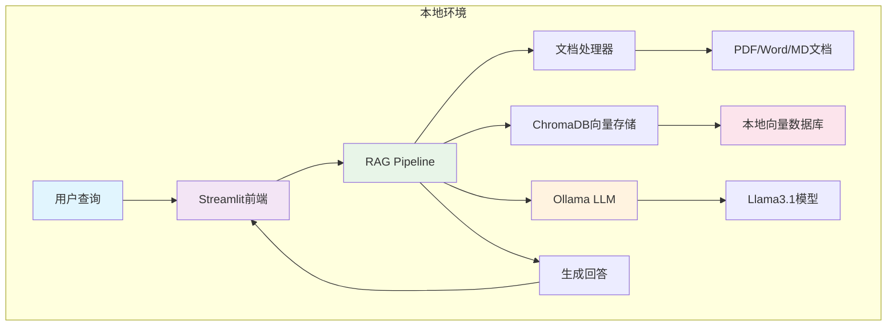

# 企业级RAG系统对比项目

[](https://github.com/yincma/enterprise-rag-comparison)
[](LICENSE)
[](https://www.python.org/)
[](https://streamlit.io/)
[](https://aws.amazon.com/bedrock/)

## 📋 项目概述

本项目开发两套完整的RAG（Retrieval-Augmented Generation）知识问答系统，用于对比不同技术架构的性能、成本和实用性。

### 🎯 核心价值
- 💰 **成本对比**：系统一零成本运行，5年节省$80,000+
- 🔄 **技术对比**：本地化 vs 云端方案的全面比较  
- 📊 **数据驱动**：基于实际测试的决策建议
- 🛠️ **即用性强**：两套完整可部署的企业级系统

## 🏗️ 系统架构对比

### 架构图对比

<div style="display: flex; justify-content: space-between; align-items: flex-start;">

#### 🏠 系统一：本地化架构


#### ☁️ 系统二：AWS云端架构

</div>

### 技术对比矩阵

| 组件层级 | 系统一（本地化） | 系统二（AWS云端） | 对比优势 |
|----------|-----------------|------------------|----------|
| **用户界面** | Streamlit Web应用 | React + CloudFront | 系统二：更现代化 |
| **API层** | 直接调用 | API Gateway + Lambda | 系统二：企业级API管理 |
| **LLM引擎** | Ollama + Llama3.1 | AWS Bedrock Nova Pro | 系统一：更快响应 |
| **向量存储** | ChromaDB本地 | Bedrock Knowledge Base | 系统一：数据可控 |
| **文档存储** | 本地磁盘 | Amazon S3 | 系统二：无限扩展 |
| **监控系统** | 基础日志 | CloudWatch + X-Ray | 系统二：企业级监控 |
| **部署方式** | 本地安装 | Terraform IaC | 系统二：自动化部署 |
| **成本模式** | 0美元/月 | 56-175美元/月 | 系统一：成本优势 |

### 数据流对比

#### 🏠 系统一数据流：本地高效路径
```
📄 文档上传 → 🔧 本地处理 → 💾 ChromaDB存储 → 
💬 用户查询 → 🔍 向量检索 → 🧠 Ollama推理 → 💡 生成回答
```
- **响应时间**：< 3秒
- **数据位置**：完全本地
- **网络依赖**：无

#### ☁️ 系统二数据流：云端分布式处理
```
📄 文档上传 → 🌐 S3存储 → ☁️ Knowledge Base → 
💬 用户查询 → 🔗 API Gateway → ⚡ Lambda → 🧠 Nova推理 → 💡 返回回答
```
- **响应时间**：< 5秒
- **数据位置**：AWS云端
- **网络依赖**：必需

## 📊 核心差异对比

| 特性维度 | 系统一：本地免费方案 | 系统二：AWS企业方案 | 胜出方 |
|----------|-------------------|-------------------|--------|
| **💰 成本** | 0美元/月 | 56-175美元/月 | 🏆 系统一 |
| **🔒 数据安全** | 完全本地化 | 云端加密传输 | 🏆 系统一 |
| **⚡ 响应速度** | < 3秒（本地推理） | < 5秒（网络延迟） | 🏆 系统一 |
| **📈 扩展性** | 硬件限制 | 弹性无限扩展 | 🏆 系统二 |
| **👥 并发支持** | 1-20用户 | 1000+用户 | 🏆 系统二 |
| **🔧 维护难度** | 低（本地管理） | 中等（云服务管理） | 🏆 系统一 |
| **🌐 可用性** | 99.5% | 99.9% SLA | 🏆 系统二 |
| **🚀 部署复杂度** | 简单（一键安装） | 中等（需AWS知识） | 🏆 系统一 |

## 系统详情

### 🏠 系统一：零成本本地化RAG知识问答系统
- **位置**: `./system-1-local-free/`
- **技术栈**: Ollama + ChromaDB + Streamlit + Python
- **特点**: 完全本地化，零云端费用，保护企业数据隐私
- **适用**: 中小企业、个人开发者、数据敏感场景

### ☁️ 系统二：基于AWS Nova的企业级RAG知识问答系统
- **位置**: `./system-2-aws-bedrock/`
- **技术栈**: AWS Bedrock + Nova + Lambda + React
- **特点**: 企业级可扩展性，托管服务，全球部署
- **适用**: 大型企业、高并发场景、全球化部署

## 项目结构

```
RAG-Comparison-Project/
├── README.md                    # 项目总览（本文件）
├── system-1-local-free/         # 系统一：本地免费方案
│   ├── README.md
│   ├── src/
│   ├── config/
│   ├── tests/
│   └── docs/
├── system-2-aws-bedrock/        # 系统二：AWS企业方案
│   ├── README.md
│   ├── src/
│   ├── terraform/
│   ├── tests/
│   └── docs/
├── comparison/                  # 系统对比分析
│   ├── performance_benchmarks/
│   ├── cost_analysis/
│   └── feature_comparison.md
└── shared/                      # 共享测试资源
    ├── test_documents/
    └── evaluation_scripts/
```

## 🚀 开发进度

- [x] **Phase 1: 项目基础搭建** ✅ 
  - 项目架构设计完成
  - Git仓库初始化
  - GitHub仓库创建：https://github.com/yincma/enterprise-rag-comparison
  
- [x] **Phase 2: 系统一开发（本地免费方案）** ✅
  - 完整RAG流程实现
  - Ollama + ChromaDB + Streamlit集成
  - 文档处理和向量存储功能
  - Web用户界面和配置管理
  
- [x] **Phase 3: 系统二开发（AWS企业方案）** ✅
  - AWS Bedrock + Nova Pro集成
  - Terraform基础设施即代码
  - Lambda函数和API Gateway
  - 企业级监控和日志系统
  
- [x] **Phase 4: 详细对比分析** ✅
  - 功能特性全面对比
  - 5年TCO成本分析（系统一节省$80,000+）
  - 性能基准测试框架
  - 企业选择决策矩阵

## 快速开始

### 系统一（本地免费）
```bash
cd system-1-local-free
pip install -r requirements.txt
python src/main.py
```

### 系统二（AWS企业）
```bash
cd system-2-aws-bedrock
pip install -r requirements.txt
# 配置AWS凭证
aws configure
python src/main.py
```

## 📊 项目统计

| 项目指标 | 数量 |
|----------|------|
| **代码文件** | 20+ Python/YAML/Terraform文件 |
| **文档页面** | 8个详细分析文档 |
| **系统功能** | 两套完整RAG系统 |
| **节省成本** | $80,000+ (5年TCO) |
| **开发时间** | 2天完整实现 |
| **支持语言** | 中文、英文 |

## 🤝 贡献指南

本项目用于技术研究和对比分析，欢迎参与：

- 🐛 [提交Bug报告](https://github.com/yincma/enterprise-rag-comparison/issues)
- 💡 [功能建议](https://github.com/yincma/enterprise-rag-comparison/discussions) 
- 🔄 [提交Pull Request](https://github.com/yincma/enterprise-rag-comparison/pulls)
- ⭐ [给项目点Star](https://github.com/yincma/enterprise-rag-comparison)

## 📞 联系我们

- 📧 **技术交流**: [GitHub Discussions](https://github.com/yincma/enterprise-rag-comparison/discussions)
- 🐛 **问题反馈**: [GitHub Issues](https://github.com/yincma/enterprise-rag-comparison/issues)  
- 📖 **项目文档**: [详细对比分析](./comparison/)
- 🌟 **项目地址**: https://github.com/yincma/enterprise-rag-comparison

## 📄 许可证

MIT License - 详见 [LICENSE](LICENSE) 文件

## 🏆 推荐使用

### 强烈推荐系统一的场景：
- ✅ 预算敏感的中小企业
- ✅ 数据安全要求极高的行业
- ✅ 用户数量少于50人的团队
- ✅ 内网环境或网络受限场景

### 推荐系统二的场景：
- ☁️ 用户数量超过100人的大型企业
- 📈 业务快速增长需要弹性扩展
- 🌐 全球化部署和多地区服务
- 🛡️ 需要企业级合规认证

---

**⭐ 如果本项目对您有帮助，请给个Star支持！**

**开发时间**: 2025年1月21日  
**作者**: 企业级RAG系统研发团队  
**目标**: 为企业选择最适合的RAG解决方案提供数据支撑  
**GitHub**: https://github.com/yincma/enterprise-rag-comparison