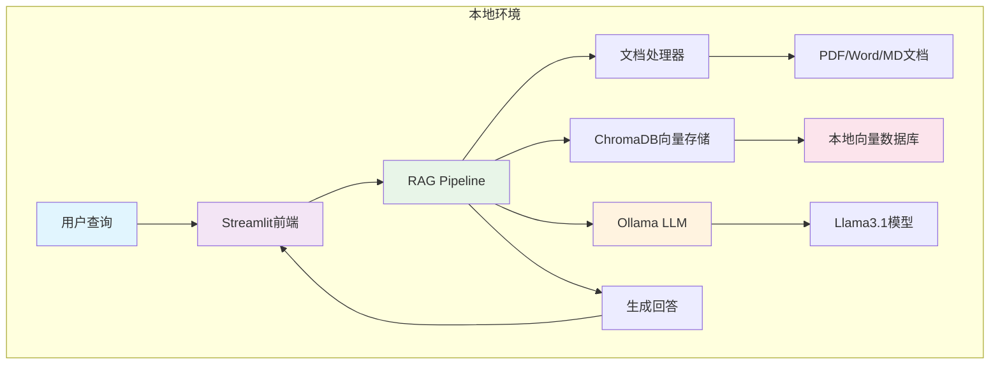

# 企业级RAG系统对比项目

[](https://github.com/yincma/enterprise-rag-comparison)
[](LICENSE)
[](https://www.python.org/)
[](https://streamlit.io/)
[](https://aws.amazon.com/bedrock/)

## 📋 项目概述

本项目开发两套完整的RAG（Retrieval-Augmented Generation）知识问答系统，用于对比不同技术架构的性能、成本和实用性。

## 🏗️ 系统架构对比

### 架构图对比

<div style="display: flex; justify-content: space-between; align-items: flex-start;">

#### 🏠 系统一：本地化架构


#### ☁️ 系统二：AWS云端架构

</div>

### 技术对比矩阵

| 组件层级 | 系统一（本地化） | 系统二（AWS云端） | 对比优势 |
|----------|-----------------|------------------|----------|
| **用户界面** | Streamlit Web应用 + FastAPI | React + CloudFront | 系统二：更现代化 |
| **API层** | FastAPI + Uvicorn | API Gateway + Lambda | 系统一：轻量高效 |
| **LLM引擎** | Ollama + Llama3.1 | AWS Bedrock Nova Pro | 系统二：模型强大 |
| **向量存储** | ChromaDB本地 | Bedrock Knowledge Base | 系统一：数据可控 |
| **文档存储** | 本地磁盘 | Amazon S3 | 系统二：可拓展性 |
| **测试框架** | pytest完整测试套件 | AWS测试工具 | 系统一：测试完备 |
| **监控系统** | 内置性能监控 | CloudWatch + X-Ray | 系统二：企业级监控 |
| **部署方式** | 一键安装 | Terraform IaC | 系统二：IaC一键部署 |
| **成本模式** | 0美元/月 | 56-175美元/月 | 系统一：成本优势 |

### 数据流对比

#### 🏠 系统一数据流：本地高效路径
```
📄 文档上传 → 🔧 本地处理 → 💾 ChromaDB存储 → 
💬 用户查询 → 🔍 向量检索 → 🧠 Ollama推理 → 💡 生成回答
```
- **响应时间**：< 3秒
- **数据位置**：完全本地
- **网络依赖**：无

#### ☁️ 系统二数据流：云端分布式处理
```
📄 文档上传 → 🌐 S3存储 → ☁️ Knowledge Base → 
💬 用户查询 → 🔗 API Gateway → ⚡ Lambda → 🧠 Nova推理 → 💡 返回回答
```
- **响应时间**：< 5秒
- **数据位置**：AWS云端
- **网络依赖**：必需

### ⚡ 功能完整性保证

| 功能模块 | 状态 | 说明 |
|---------|------|------|
| ✅ **Streamlit界面** | 100%保留 | 完整Web用户界面 |
| ✅ **FastAPI服务** | 新增 | RESTful API支持 |
| ✅ **RAG核心引擎** | 100%保留 | Ollama + ChromaDB |
| ✅ **文档处理** | 100%保留 | PDF/Word/MD支持 |
| ✅ **向量存储** | 100%保留 | 33MB知识库数据 |
| ✅ **配置管理** | 100%保留 | YAML配置系统 |
| ✅ **pytest测试** | 新增 | 完整测试框架 |
| ✅ **性能监控** | 新增 | 内存/CPU监控工具 |

## 系统详情

### 🏠 系统一：零成本本地化RAG知识问答系统 (v1.1.0 精简优化版)
- **位置**: `./system-1-local-free/` 
- **技术栈**: Ollama + ChromaDB + Streamlit + FastAPI + pytest
- **核心特点**: 
  - 🚀 **双接口支持**: Streamlit Web界面 + FastAPI RESTful API
  - 🧪 **测试完备**: pytest完整测试套件，代码质量保证
  - 🔒 **数据隐私**: 完全本地化，零云端费用
  - ⚡ **高性能**: 内置内存优化器和弹性处理模块
- **适用场景**: 中小企业、个人开发者、数据敏感场景、存储受限环境

### ☁️ 系统二：基于AWS Nova的企业级RAG知识问答系统
- **位置**: `./system-2-aws-bedrock/`
- **技术栈**: AWS Bedrock + Nova + Lambda + React
- **特点**: 企业级可扩展性，托管服务，全球部署
- **适用**: 大型企业、高并发场景、全球化部署

## 项目结构

```
RAG-Comparison-Project/
├── README.md                    # 项目总览（本文件）
├── system-1-local-free/         # 系统一：本地免费方案
│   ├── README.md
│   ├── src/
│   ├── config/
│   ├── tests/
│   └── docs/
├── system-2-aws-bedrock/        # 系统二：AWS企业方案
│   ├── README.md
│   ├── src/
│   ├── terraform/
│   ├── tests/
│   └── docs/
├── comparison/                  # 系统对比分析
│   ├── performance_benchmarks/
│   ├── cost_analysis/
│   └── feature_comparison.md
└── shared/                      # 共享测试资源
    ├── test_documents/
    └── evaluation_scripts/
```
## 🚀 快速开始

### 🏠 系统一
如果您使用 macOS，可以按以下步骤快速安装：

```bash
# 1. 确保已安装 Homebrew 和 Python 3.8+
python --version

# 2. 克隆项目并设置环境
cd system-1-local-free
python -m venv venv
source venv/bin/activate
pip install -r requirements.txt

# 3. 安装并启动 Ollama
brew install ollama
ollama serve &

# 4. 下载模型并启动应用
ollama pull llama3.1:8b
streamlit run src/main.py
```


### ☁️ 系统二（AWS企业）
```bash
cd system-2-aws-bedrock
pip install -r requirements.txt
# 配置AWS凭证
aws configure
python src/main.py
```

## 🤝 贡献指南

本项目用于技术研究和对比分析，欢迎参与：

- 🐛 [提交Bug报告](https://github.com/yincma/enterprise-rag-comparison/issues)
- 💡 [功能建议](https://github.com/yincma/enterprise-rag-comparison/discussions) 
- 🔄 [提交Pull Request](https://github.com/yincma/enterprise-rag-comparison/pulls)
- ⭐ [给项目点Star](https://github.com/yincma/enterprise-rag-comparison)

## 📞 联系我们

- 📧 **技术交流**: [GitHub Discussions](https://github.com/yincma/enterprise-rag-comparison/discussions)
- 🐛 **问题反馈**: [GitHub Issues](https://github.com/yincma/enterprise-rag-comparison/issues)  
- 📖 **项目文档**: [详细对比分析](./comparison/)
- 🌟 **项目地址**: https://github.com/yincma/enterprise-rag-comparison


## 🏆 推荐使用

### 强烈推荐系统一的场景：
- ✅ 预算敏感的中小企业
- ✅ 数据安全要求极高的行业
- ✅ 用户数量少于50人的团队
- ✅ 内网环境或网络受限场景

### 推荐系统二的场景：
- ☁️ 用户数量超过100人的大型企业
- 📈 业务快速增长需要弹性扩展
- 🌐 全球化部署和多地区服务
- 🛡️ 需要企业级合规认证

---

**⭐ 如果本项目对您有帮助，请给个Star支持！**
