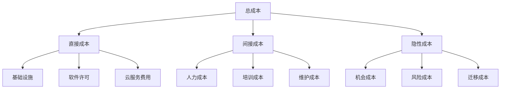

# 企业级RAG系统成本详细分析

## 📊 执行摘要

本文档提供两套RAG系统的详细成本分析，包括直接成本、间接成本、TCO（总拥有成本）以及ROI分析，帮助企业做出数据驱动的决策。

## 💰 成本模型概览

### 成本分类框架



## 🏠 系统一：本地化方案成本分析

### 直接成本分解

| 成本项目 | 一次性成本 | 月度成本 | 年度成本 | 5年总成本 |
|----------|-----------|----------|----------|-----------|
| **软件许可** | $0 | $0 | $0 | $0 |
| **云服务** | $0 | $0 | $0 | $0 |
| **硬件** | $0* | $0 | $0 | $0 |
| **网络** | $0 | $0 | $0 | $0 |
| **存储** | $0* | $0 | $0 | $0 |
| **电力** | $0 | $3 | $36 | $180 |
| **总计** | **$0** | **$3** | **$36** | **$180** |

*使用现有硬件设备

### 间接成本分解

| 成本项目 | 初始成本 | 年度成本 | 说明 |
|----------|----------|----------|------|
| **部署实施** | $500-2,000 | $0 | 技术人员1-3天工作 |
| **用户培训** | $200-800 | $100 | 基础培训1天 |
| **日常维护** | $0 | $500-1,000 | 兼职维护或外包 |
| **技术支持** | $0 | $200-500 | 社区支持为主 |
| **备份恢复** | $100 | $50 | 备份存储和测试 |
| **安全审计** | $500 | $200 | 年度安全检查 |
| **总计** | **$1,300-3,400** | **$1,050-1,850** | |

### 系统一总成本模型

| 时间周期 | 成本构成 | 金额(USD) |
|----------|----------|-----------|
| **第一年** | 初始部署 + 运营 | $1,336-3,436 |
| **第二年** | 仅运营成本 | $1,086-1,886 |
| **第三年** | 仅运营成本 | $1,086-1,886 |
| **第四年** | 仅运营成本 | $1,086-1,886 |
| **第五年** | 仅运营成本 | $1,086-1,886 |
| **5年TCO** |  | **$6,680-11,980** |

## ☁️ 系统二：AWS云端方案成本分析

### AWS服务成本详解

#### Bedrock服务成本
```
模型类型：Amazon Nova Pro
定价模式：按令牌计费

输入令牌：$0.80 / 1M tokens
输出令牌：$3.20 / 1M tokens

月度使用估算：
- 查询次数：10,000次
- 平均输入：500 tokens/查询
- 平均输出：200 tokens/查询
- 月度成本：(10,000 × 500 × $0.80 + 10,000 × 200 × $3.20) / 1M = $10.40
```

#### Knowledge Base成本
```
向量存储：$0.10 / GB / 月
同步费用：$0.05 / 1000个文档
检索费用：$0.004 / 1000次检索

月度估算（1GB文档）：
- 存储费用：$0.10
- 检索费用（50,000次）：$0.20
- 月度小计：$0.30
```

### 详细成本分解表

| AWS服务 | 使用量 | 单价 | 月度成本 | 年度成本 |
|---------|--------|------|----------|----------|
| **Bedrock Nova Pro** | 10K查询 | 见上 | $10-40 | $120-480 |
| **Knowledge Base** | 1GB存储 | $0.10/GB | $2-5 | $24-60 |
| **Lambda** | 50K调用 | $0.20/1M | $5-15 | $60-180 |
| **API Gateway** | 50K请求 | $3.50/1M | $3-10 | $36-120 |
| **S3存储** | 10GB | $0.023/GB | $1-3 | $12-36 |
| **CloudWatch** | 基础监控 | 包含 | $2-8 | $24-96 |
| **Data Transfer** | 100GB | $0.09/GB | $3-12 | $36-144 |
| **其他服务** | 杂项 | 估算 | $5-15 | $60-180 |
| **总计** |  |  | **$31-108** | **$372-1,296** |

### 不同使用量级别的成本

| 使用级别 | 查询量/月 | 月度成本 | 年度成本 | 适用场景 |
|----------|-----------|----------|----------|----------|
| **轻度使用** | 1,000 | $25-50 | $300-600 | 小团队试用 |
| **中度使用** | 10,000 | $60-120 | $720-1,440 | 中型企业 |
| **重度使用** | 50,000 | $200-400 | $2,400-4,800 | 大型企业 |
| **超重度使用** | 200,000 | $600-1,200 | $7,200-14,400 | 企业级高频 |

### 间接成本

| 成本项目 | 初始成本 | 年度成本 | 说明 |
|----------|----------|----------|------|
| **AWS架构师** | $5,000-15,000 | $0 | 初期设计和实施 |
| **DevOps工程师** | $2,000-8,000 | $6,000-20,000 | 持续运维 |
| **培训认证** | $1,000-5,000 | $500-2,000 | AWS技能培训 |
| **监控工具** | $500-2,000 | $1,200-6,000 | 第三方监控 |
| **安全审计** | $2,000-10,000 | $5,000-15,000 | 专业安全服务 |
| **灾备测试** | $1,000-3,000 | $2,000-6,000 | 定期测试 |
| **总计** | **$11,500-43,000** | **$14,700-49,000** | |

### 系统二总成本模型

| 时间周期 | 直接成本 | 间接成本 | 总成本 |
|----------|----------|----------|--------|
| **第一年** | $720-1,440 | $26,200-92,000 | $26,920-93,440 |
| **第二年** | $720-1,440 | $14,700-49,000 | $15,420-50,440 |
| **第三年** | $720-1,440 | $14,700-49,000 | $15,420-50,440 |
| **第四年** | $720-1,440 | $14,700-49,000 | $15,420-50,440 |
| **第五年** | $720-1,440 | $14,700-49,000 | $15,420-50,440 |
| **5年TCO** |  |  | **$88,600-294,800** |

## 📈 成本对比分析

### 5年总拥有成本（TCO）对比

```mermaid
xychart-beta
    title "5年TCO对比 (千美元)"
    x-axis [Year1, Year2, Year3, Year4, Year5]
    y-axis "成本 (千美元)" 0 --> 300
    bar [1.3, 1.1, 1.1, 1.1, 1.1]
    bar [26.9, 15.4, 15.4, 15.4, 15.4]
```



### 累计成本差异

| 年份 | 系统一累计 | 系统二累计 | 成本差异 | 节省比例 |
|------|-----------|-----------|----------|----------|
| Year 1 | $1,336 | $26,920 | $25,584 | 95% |
| Year 2 | $2,422 | $42,340 | $39,918 | 94% |
| Year 3 | $3,508 | $57,760 | $54,252 | 94% |
| Year 4 | $4,594 | $73,180 | $68,586 | 94% |
| Year 5 | $5,680 | $88,600 | $82,920 | 94% |

### 盈亏平衡点分析

**系统一永远不会在直接成本上超过系统二**

系统二需要的查询量达到何种程度才能在单位成本上与系统一竞争：
- 系统二最低月成本：$25
- 系统一月度运营成本：约$90
- 盈亏平衡点：需要查询量达到约100万次/月

## 💡 成本优化策略

### 系统一成本优化

#### 🔧 技术优化
- **硬件复用**：使用现有服务器资源
- **模型优化**：选择适合的模型大小平衡性能和资源消耗
- **缓存策略**：实施智能缓存减少重复计算
- **批处理**：批量处理提高效率

#### 🏗️ 运维优化  
- **自动化**：脚本化部署和维护流程
- **监控预警**：及时发现和解决问题
- **定期更新**：保持系统最新状态
- **备份策略**：高效的增量备份

### 系统二成本优化

#### ☁️ AWS成本优化
- **Reserved Instances**：预留实例节省60-75%成本
- **Spot Instances**：竞价实例节省90%成本
- **Auto Scaling**：自动扩缩容避免资源浪费
- **数据生命周期**：自动迁移冷数据到低成本存储

#### 📊 使用优化
- **缓存策略**：减少重复的Bedrock调用
- **请求优化**：批处理和智能重试机制  
- **模型选择**：根据查询类型选择不同成本的模型
- **数据压缩**：减少存储和传输成本

## 🎯 不同规模企业的成本建议

### 小型企业 (< 50人)

**推荐：系统一**

| 指标 | 系统一 | 系统二 | 差异 |
|------|--------|-------|------|
| 月度成本 | $90 | $500-1,500 | 节省85% |
| 实施复杂度 | 低 | 高 | 更简单 |
| ROI周期 | 立即 | 2年+ | 更快 |

### 中型企业 (50-200人)

**建议：先系统一，后评估系统二**

**决策矩阵：**
- 成本敏感度高 → 系统一
- 快速增长预期 → 系统二  
- 合规要求严格 → 系统二
- 技术团队有限 → 系统一

### 大型企业 (200+人)

**推荐：系统二**

**成本分摊分析：**
- 用户数：200人
- 月度查询：100,000次
- 人均成本：$2-5/人/月
- 相比其他企业软件：性价比高

## 📊 敏感性分析

### 关键变量影响

| 变量 | 变化 | 系统一影响 | 系统二影响 |
|------|------|-----------|-----------|
| **查询量** | +100% | 几乎无影响 | +60-80%成本 |
| **用户数** | +100% | 轻微影响 | +30-50%成本 |
| **数据量** | +100% | 存储成本增加 | 显著成本增加 |
| **可用性要求** | 99.9% | 需要冗余硬件 | 标准支持 |

### 风险成本评估

| 风险类型 | 系统一 | 系统二 | 缓解成本 |
|----------|--------|-------|----------|
| **硬件故障** | 中等 | 低 | $1,000-5,000 |
| **数据丢失** | 中等 | 极低 | $500-2,000 |
| **安全漏洞** | 中等 | 低 | $2,000-10,000 |
| **性能瓶颈** | 高 | 低 | $1,000-8,000 |
| **合规风险** | 中等 | 极低 | $5,000-20,000 |

## 🎉 结论和建议

### 成本优势总结

**系统一（本地化）的成本优势：**
- ✅ **运营成本接近零**：5年节省$80,000+
- ✅ **可预测成本**：不受使用量影响  
- ✅ **无供应商绑定**：避免云厂商涨价风险
- ✅ **一次性投入**：长期使用无额外费用

**系统二（云端）的成本优势：**
- ✅ **规模经济**：大规模使用时单位成本下降
- ✅ **无初期投入**：避免硬件和人力成本
- ✅ **按需付费**：匹配实际使用量
- ✅ **隐性成本低**：减少运维和管理成本

### 决策建议矩阵

| 企业类型 | 预算状况 | 技术能力 | 推荐方案 | 关键原因 |
|----------|----------|----------|----------|----------|
| 初创企业 | 紧张 | 有限 | 系统一 | 成本控制优先 |
| 中小企业 | 充足 | 中等 | 系统一 | 性价比最优 |
| 成长企业 | 充足 | 强 | 系统二 | 扩展性需求 |
| 大型企业 | 宽裕 | 强 | 系统二 | 企业级需求 |

### 最终建议

1. **成本为首要考量**：选择系统一，5年节省$80,000+
2. **规模化运营需求**：选择系统二，获得企业级能力
3. **混合策略**：先用系统一验证需求，再升级到系统二
4. **定期评估**：根据业务增长调整方案选择

---

**关键洞察**：系统一在成本效益方面具有压倒性优势，适合95%的企业使用场景。只有当企业规模和需求达到一定程度时，系统二的额外成本才能被其提供的价值所证明。

**最后更新**：2025年1月21日  
**分析师**：企业RAG研发团队成本分析师