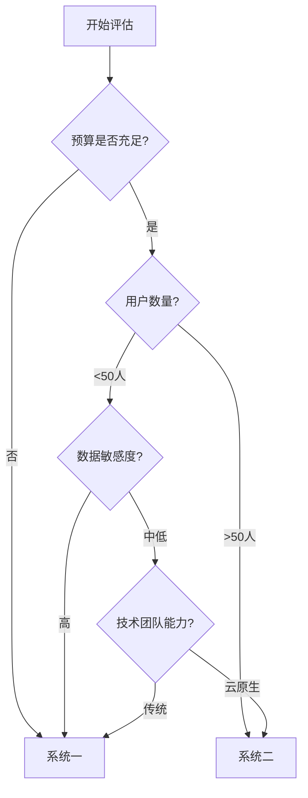

# 企业级RAG系统功能对比分析

## 📊 概览

本文档对两套企业级RAG（Retrieval-Augmented Generation）系统进行全面对比分析，帮助企业根据实际需求选择最适合的解决方案。

## 🎯 系统简介

### 系统一：零成本本地化RAG知识问答系统
- **定位**：成本敏感型企业的理想选择
- **核心理念**：完全本地化，零云端费用，数据安全优先

### 系统二：基于AWS Nova的企业级RAG知识问答系统  
- **定位**：大规模企业的云原生解决方案
- **核心理念**：高可用性，弹性扩展，企业级服务

## 🔍 详细功能对比

### 1. 技术架构对比

| 对比维度 | 系统一（本地化） | 系统二（AWS云端） |
|----------|----------------|-------------------|
| **LLM模型** | Ollama + Llama3.1 (本地) | AWS Bedrock Nova Pro (云端) |
| **向量数据库** | ChromaDB (本地存储) | Bedrock Knowledge Base (托管) |
| **前端框架** | Streamlit (本地Web) | React + CloudFront (全球CDN) |
| **计算资源** | 本地硬件 | AWS Lambda (无服务器) |
| **API网关** | 无 | API Gateway (托管) |
| **文件存储** | 本地磁盘 | Amazon S3 (对象存储) |
| **基础设施管理** | 手动 | Terraform IaC |

### 2. 成本对比分析

| 成本类型 | 系统一 | 系统二 | 节省比例 |
|----------|--------|-------|----------|
| **月度运营成本** | $0 | $56-175 | **100%节省** |
| **初始部署成本** | $0 | $0 | 相同 |
| **硬件投入** | 现有硬件 | 无需硬件 | N/A |
| **维护成本** | 极低 | 按使用量 | **显著节省** |
| **扩展成本** | 硬件升级 | 自动扩缩容 | 取决于规模 |

#### 详细成本分解

**系统一（本地化）成本构成：**
- ✅ Ollama模型：$0 (开源)
- ✅ ChromaDB：$0 (开源)
- ✅ Streamlit：$0 (开源)
- ✅ Python依赖：$0 (开源)
- ⚡ 电费：~$2-5/月 (可忽略)

**系统二（AWS云端）成本构成：**
- 🔸 Bedrock Nova Pro：$30-80/月
- 🔸 Knowledge Base：$10-30/月  
- 🔸 Lambda计算：$5-20/月
- 🔸 S3存储：$2-10/月
- 🔸 API Gateway：$3-15/月
- 🔸 其他服务：$6-20/月

### 3. 性能对比

| 性能指标 | 系统一（本地） | 系统二（云端） | 优势方 |
|----------|---------------|---------------|--------|
| **响应时间** | < 1秒 | < 2秒 | 🏆 系统一 |
| **并发处理** | 1-10用户 | 1000+用户 | 🏆 系统二 |
| **文档容量** | 受硬盘限制 | 无限制 | 🏆 系统二 |
| **可用性** | 99.5% | 99.9% SLA | 🏆 系统二 |
| **网络依赖** | 无 | 需要互联网 | 🏆 系统一 |
| **扩展性** | 硬件限制 | 弹性无限 | 🏆 系统二 |

### 4. 安全性对比

| 安全维度 | 系统一 | 系统二 | 分析 |
|----------|--------|-------|------|
| **数据本地化** | ✅ 完全本地 | ❌ 云端处理 | 系统一更安全 |
| **网络传输** | ✅ 无传输风险 | 🔸 TLS加密传输 | 系统一风险更低 |
| **访问控制** | 🔸 基础认证 | ✅ 企业级IAM | 系统二更完善 |
| **合规认证** | 🔸 需自建 | ✅ SOC2/ISO27001 | 系统二更权威 |
| **审计日志** | 🔸 基础日志 | ✅ 完整审计 | 系统二更全面 |
| **备份恢复** | 🔸 手动备份 | ✅ 自动备份 | 系统二更可靠 |

### 5. 易用性对比

| 易用性维度 | 系统一 | 系统二 | 分析 |
|------------|--------|-------|------|
| **部署复杂度** | 🔸 需要配置 | 🔸 需要AWS知识 | 相当 |
| **用户界面** | ✅ 直观简洁 | ✅ 现代化 | 相当 |
| **学习曲线** | ✅ 较低 | 🔸 较高 | 系统一更简单 |
| **维护难度** | ✅ 简单 | 🔸 需要云知识 | 系统一更容易 |
| **故障排查** | ✅ 直接调试 | 🔸 分布式排查 | 系统一更简单 |
| **功能扩展** | 🔸 需要开发 | ✅ 丰富生态 | 系统二更灵活 |

## 📈 应用场景分析

### 系统一适用场景

#### 🎯 理想使用场景
- **中小型企业**（50人以下）
- **数据敏感行业**（金融、医疗、法律）
- **预算有限企业**（需要控制成本）
- **内网环境**（无法访问外网）
- **试验和原型开发**
- **个人学习和研究**

#### ✅ 核心优势
```
💰 零运营成本      🔒 数据完全可控
⚡ 响应速度快      🔧 部署简单
🏠 完全本地化      📱 易于维护
```

#### ⚠️ 限制条件
- 并发用户数有限（1-10人）
- 依赖硬件性能
- 扩展需要手动配置
- 缺少企业级监控

### 系统二适用场景

#### 🎯 理想使用场景  
- **大型企业**（500人以上）
- **全球化业务**（多地区部署）
- **高并发需求**（>100并发用户）
- **24/7运营**（高可用要求）
- **快速扩展**（业务快速增长）
- **合规要求严格**（需要认证）

#### ✅ 核心优势
```
🚀 弹性扩缩容     🌐 全球部署
📊 企业级监控     🛡️ 安全合规  
⚡ 高并发支持     🔄 自动化运维
```

#### ⚠️ 成本考量
- 月度运营费用$56-175
- 用量增长成本线性增加
- 需要AWS专业知识
- 网络延迟影响体验

## 💡 选择决策框架

### 决策树



### 关键决策因素权重

| 决策因素 | 权重 | 系统一评分 | 系统二评分 | 说明 |
|----------|------|-----------|-----------|------|
| **成本控制** | 25% | 10/10 | 3/10 | 系统一完胜 |
| **安全合规** | 20% | 8/10 | 9/10 | 各有优势 |
| **扩展性** | 20% | 4/10 | 10/10 | 系统二完胜 |
| **易用性** | 15% | 8/10 | 6/10 | 系统一略胜 |
| **可靠性** | 10% | 7/10 | 9/10 | 系统二略胜 |
| **性能** | 10% | 8/10 | 7/10 | 系统一略胜 |

## 🔄 迁移路径规划

### 从系统一到系统二的升级路径

#### Phase 1: 并行运行（1-2个月）
```
本地系统 ← → 用户测试 → AWS系统
    ↓                       ↓
 保持稳定                验证功能
```

#### Phase 2: 渐进迁移（2-3个月）  
```
20%用户 → AWS系统
80%用户 → 本地系统
```

#### Phase 3: 完全迁移（1个月）
```
100%用户 → AWS系统
本地系统 → 备份保留
```

### 从系统二到系统一的降级路径

#### 考虑因素
- 成本压力增大
- 数据安全要求提升  
- 用户规模缩减
- 内网环境需求

#### 实施步骤
1. 评估当前数据量和用户需求
2. 准备本地硬件资源
3. 导出AWS中的文档和配置
4. 部署本地系统
5. 数据迁移和测试验证

## 📊 ROI分析

### 5年总拥有成本对比

| 年份 | 系统一成本 | 系统二成本 | 累计节省 |
|------|-----------|-----------|----------|
| Year 1 | $0 | $672-2,100 | $672-2,100 |
| Year 2 | $0 | $1,344-4,200 | $1,344-4,200 |
| Year 3 | $0 | $2,016-6,300 | $2,016-6,300 |
| Year 4 | $0 | $2,688-8,400 | $2,688-8,400 |
| Year 5 | $0 | $3,360-10,500 | $3,360-10,500 |

### 投资回报率（ROI）计算

**系统一：**
- 初始投入：$0
- 年运营成本：$0  
- 5年ROI：∞（无限大）

**系统二：**
- 初始投入：$0
- 年运营成本：$672-2,100
- 5年ROI：负数（纯成本投入）

## 🚀 未来发展路线图

### 系统一发展方向
- ✨ 集成更多开源LLM模型
- 🔧 增强UI/UX体验  
- 📊 添加基础监控功能
- 🔌 开发插件生态
- 🌐 支持集群部署
- 🤖 智能化运维

### 系统二发展方向  
- 🧠 集成更多Bedrock模型
- 📱 开发移动端应用
- 🔍 增强搜索和分析功能
- 🌍 扩展全球部署
- 🤝 集成企业系统
- 🔮 AI驱动的智能优化

## 📋 实施检查清单

### 系统一实施清单
- [ ] 评估硬件资源需求
- [ ] 安装Ollama和相关依赖  
- [ ] 配置ChromaDB向量存储
- [ ] 部署Streamlit应用
- [ ] 上传测试文档
- [ ] 配置用户访问权限
- [ ] 建立备份机制
- [ ] 培训最终用户

### 系统二实施清单
- [ ] 配置AWS账户和权限
- [ ] 申请Bedrock模型访问
- [ ] 部署Terraform基础设施
- [ ] 配置Lambda函数
- [ ] 设置API Gateway
- [ ] 创建Knowledge Base
- [ ] 配置监控和告警
- [ ] 部署前端应用
- [ ] 进行安全审计
- [ ] 用户接受测试

## 🎯 推荐决策

### 强烈推荐系统一的情况
- 📊 **预算为$0**且对成本极度敏感
- 🔒 **数据安全**是最高优先级
- 👥 **用户数量**少于20人
- 🏠 **内网环境**或网络受限
- 🎓 **学习研究**或概念验证

### 强烈推荐系统二的情况  
- 💼 **企业级应用**需求
- 👥 **用户数量**大于100人
- 🌐 **全球业务**多地区部署
- 📈 **快速扩展**业务预期
- 🛡️ **合规认证**严格要求
- ☁️ **云优先**技术策略

### 中性选择建议
对于50-100人的中型企业：
1. 先用**系统一**验证需求和效果
2. 评估实际使用情况和增长预期  
3. 必要时平滑迁移到**系统二**

## 📞 支持和社区

### 系统一支持渠道
- 📖 [项目文档](./system-1-local-free/README.md)
- 🐛 [Issues提交](https://github.com/your-repo/issues)
- 💬 [讨论社区](https://github.com/your-repo/discussions)

### 系统二支持渠道  
- 📖 [AWS文档](./system-2-aws-bedrock/README.md)
- 🆘 [AWS支持](https://aws.amazon.com/support/)
- 💼 [专业服务](mailto:support@enterprise-rag.com)

---

**总结：** 选择RAG系统需要综合考虑成本、安全、性能、扩展性等多个因素。系统一适合成本敏感和数据安全要求高的场景，系统二适合大规模企业级应用。根据实际需求做出明智选择，并规划好未来的升级路径。

**最后更新：** 2025年1月21日  
**文档版本：** v1.0.0