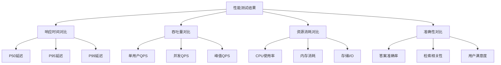

# RAG系统性能基准测试框架

## 📊 测试概述

本文档定义了企业级RAG系统的性能测试框架，提供标准化的测试方法、指标和结果对比，确保两套系统的公平比较。

## 🎯 测试目标

### 主要目标
- 📈 **响应时间测试**：端到端查询响应延迟
- 🚀 **吞吐量测试**：系统并发处理能力
- 💾 **资源消耗测试**：CPU、内存、磁盘使用率
- 🔍 **准确性测试**：答案质量和相关性评估
- ⚖️ **扩展性测试**：负载增长时的性能变化
- 🛡️ **稳定性测试**：长时间运行的可靠性

### 业务指标
- 👥 **用户体验**：实际使用场景的满意度
- 💰 **成本效益**：单位查询的成本分析
- 🔧 **运维复杂度**：部署和维护难度评估

## 🏗️ 测试环境规范

### 标准测试环境

#### 系统一测试环境
```yaml
硬件配置:
  CPU: Intel i7-12700K (8核16线程) 或 Apple M2 Pro
  内存: 32GB DDR4-3200
  存储: 1TB NVMe SSD
  网络: 千兆以太网

软件环境:
  OS: Ubuntu 22.04 LTS 或 macOS 13+
  Python: 3.11+
  Ollama: 最新版本
  ChromaDB: 0.4.22+
  Streamlit: 1.29.0+

模型配置:
  LLM: Llama3.1:8b
  Embedding: all-MiniLM-L6-v2
  向量维度: 384
  最大上下文: 4096 tokens
```

#### 系统二测试环境
```yaml
AWS配置:
  区域: us-east-1
  Lambda: Python 3.11, 512MB内存, 300s超时
  API Gateway: 区域端点
  S3: 标准存储类
  
模型配置:
  LLM: Amazon Nova Pro v1:0
  Embedding: Titan Embed Text v1
  Knowledge Base: 标准配置
  检索: top_k=5
```

### 测试数据集

#### 标准测试文档
```
文档类型分布:
- PDF文档: 40% (技术手册、报告)
- Word文档: 30% (政策文件、流程)  
- Markdown: 20% (技术文档、说明)
- 纯文本: 10% (日志、配置)

文档规模:
- 总文档数: 1,000个
- 总大小: 2GB
- 平均大小: 2MB
- 文档长度: 500-5000字
- 语言: 中文70%, 英文30%
```

#### 测试查询集
```
查询类型:
- 事实性查询: 40% (具体信息查找)
- 分析性查询: 30% (对比、总结)
- 过程性查询: 20% (步骤、流程)
- 开放性查询: 10% (意见、建议)

难度分级:
- 简单: 30% (直接匹配)
- 中等: 50% (需要理解)
- 复杂: 20% (多步推理)

查询长度:
- 短查询: 5-15字
- 中查询: 16-50字  
- 长查询: 51-200字
```

## 📏 测试指标定义

### 1. 性能指标

#### 响应时间指标
```
端到端响应时间 = 接收请求时间 - 返回响应时间

分解指标:
- 文档检索时间: 向量搜索耗时
- 上下文构建时间: 文档片段整合
- LLM推理时间: 生成答案耗时
- 网络传输时间: 请求/响应传输
- 总处理时间: 完整流程耗时

统计方法:
- 平均值 (Mean)
- 中位数 (P50) 
- 90分位数 (P90)
- 95分位数 (P95)
- 99分位数 (P99)
- 最大值 (Max)
```

#### 吞吐量指标
```
QPS (Queries Per Second): 每秒处理查询数
TPS (Transactions Per Second): 每秒完成事务数
并发用户数: 同时在线用户数量
峰值处理能力: 系统能处理的最大负载

测试场景:
- 单用户连续查询
- 多用户并发查询  
- 突发流量测试
- 长时间压力测试
```

#### 资源消耗指标
```
CPU使用率:
- 平均CPU使用率
- 峰值CPU使用率
- CPU利用率分布

内存使用:
- 内存占用量(MB)
- 内存使用率(%)
- 内存泄漏检测

存储I/O:
- 磁盘读写速度
- IOPS (每秒读写次数)
- 存储空间占用

网络I/O:
- 带宽使用量
- 网络延迟
- 数据传输量
```

### 2. 质量指标

#### 答案准确性
```
评估维度:
- 事实准确性: 答案是否正确
- 相关性: 答案与问题的匹配度
- 完整性: 答案是否全面
- 一致性: 相同问题的答案稳定性

评分标准:
- 优秀 (4分): 完全准确、高度相关
- 良好 (3分): 基本准确、相关性好
- 一般 (2分): 部分准确、相关性中等
- 较差 (1分): 准确性低、相关性差
- 失败 (0分): 无法回答或完全错误
```

#### 检索质量  
```
检索指标:
- Precision@K: 前K个结果的准确率
- Recall@K: 前K个结果的召回率
- MRR (Mean Reciprocal Rank): 平均倒数排名
- NDCG (Normalized DCG): 归一化折扣累计增益

评估方法:
- 人工评估: 专家评分
- 自动评估: 基于标准答案
- 用户评估: 实际用户反馈
```

### 3. 可用性指标

#### 系统稳定性
```
可用性 = (总时间 - 故障时间) / 总时间 × 100%

MTBF (Mean Time Between Failures): 平均故障间隔时间
MTTR (Mean Time To Repair): 平均修复时间
故障率: 单位时间内故障次数
错误率: 请求失败比例
```

## 🧪 测试用例设计

### 基准测试套件

#### Test Case 1: 单用户性能基准
```yaml
测试名称: "单用户响应时间基准"
目标: 测量无并发情况下的基础性能

测试步骤:
1. 系统预热 (10次查询)
2. 执行100次标准查询
3. 记录每次查询的详细时间
4. 计算统计指标

期望结果:
- 系统一: P95 < 3秒
- 系统二: P95 < 5秒

成功标准: 95%查询在期望时间内完成
```

#### Test Case 2: 并发压力测试
```yaml
测试名称: "并发用户压力测试"
目标: 测量系统并发处理能力

测试场景:
- 5用户并发: 轻负载
- 20用户并发: 中负载  
- 50用户并发: 重负载
- 100用户并发: 极限负载

测试持续时间: 30分钟
查询频率: 每用户每分钟5次查询

监控指标:
- 响应时间变化
- 错误率增长
- 资源使用率
- 系统稳定性
```

#### Test Case 3: 大数据集测试
```yaml
测试名称: "大规模数据处理能力"
目标: 测试系统处理大量文档的能力

数据规模:
- 小规模: 100文档, 100MB
- 中规模: 1,000文档, 1GB  
- 大规模: 10,000文档, 10GB
- 超大规模: 100,000文档, 100GB

测试指标:
- 文档索引时间
- 查询响应时间
- 存储空间使用
- 内存消耗
```

### 专项测试

#### 长时间稳定性测试
```yaml
测试名称: "72小时稳定性测试"  
目标: 验证系统长期运行稳定性

测试配置:
- 持续时间: 72小时
- 并发用户: 10个
- 查询频率: 每分钟2次
- 监控间隔: 5分钟

监控重点:
- 内存泄漏检测
- 性能退化监控
- 错误累积分析
- 资源使用趋势
```

#### 异常情况测试
```yaml
测试名称: "异常场景处理能力"
目标: 测试系统对异常情况的处理

异常场景:
1. 恶意查询注入
2. 超长查询请求  
3. 无效字符输入
4. 网络中断恢复
5. 服务重启恢复
6. 存储空间不足
7. 内存耗尽情况

评估标准:
- 错误处理优雅度
- 恢复时间
- 数据一致性
- 用户体验影响
```

## 📊 测试执行方案

### 自动化测试脚本

#### 性能测试脚本框架
```python
# performance_test.py
import time
import asyncio
import statistics
from concurrent.futures import ThreadPoolExecutor
from typing import List, Dict, Any

class PerformanceTestRunner:
    def __init__(self, system_type: str, config: Dict):
        self.system_type = system_type
        self.config = config
        self.results = []
    
    def run_benchmark(self) -> Dict[str, Any]:
        """执行完整性能基准测试"""
        results = {
            'system': self.system_type,
            'timestamp': time.time(),
            'tests': {}
        }
        
        # 单用户测试
        results['tests']['single_user'] = self.single_user_test()
        
        # 并发测试  
        results['tests']['concurrent'] = self.concurrent_test()
        
        # 资源使用测试
        results['tests']['resource_usage'] = self.resource_test()
        
        return results
    
    def single_user_test(self) -> Dict[str, Any]:
        """单用户性能测试"""
        response_times = []
        
        for i in range(100):
            start_time = time.time()
            # 执行查询
            result = self.execute_query(f"测试查询 {i}")
            end_time = time.time()
            
            response_time = end_time - start_time
            response_times.append(response_time)
        
        return {
            'mean': statistics.mean(response_times),
            'median': statistics.median(response_times),
            'p95': self.percentile(response_times, 95),
            'p99': self.percentile(response_times, 99),
            'max': max(response_times),
            'min': min(response_times)
        }
    
    def concurrent_test(self) -> Dict[str, Any]:
        """并发用户测试"""
        concurrent_levels = [5, 10, 20, 50]
        results = {}
        
        for level in concurrent_levels:
            results[f'{level}_users'] = self.run_concurrent_test(level)
        
        return results
```

#### 自动化测试部署
```bash
#!/bin/bash
# run_benchmark.sh

echo "开始RAG系统性能基准测试..."

# 系统一测试
echo "测试系统一（本地化方案）..."
cd system-1-local-free
python tests/performance/benchmark.py --config config/test_config.yaml

# 系统二测试  
echo "测试系统二（AWS云端方案）..."
cd ../system-2-aws-bedrock
python tests/performance/benchmark.py --config config/test_config.yaml

# 生成对比报告
echo "生成对比分析报告..."
python comparison/performance_benchmarks/generate_report.py

echo "测试完成！查看结果：comparison/performance_benchmarks/results/"
```

### 测试数据收集

#### 数据收集规范
```yaml
数据收集频率:
  - 实时指标: 1秒间隔
  - 性能指标: 5秒间隔  
  - 资源指标: 10秒间隔
  - 业务指标: 1分钟间隔

数据存储格式:
  - 时序数据: InfluxDB
  - 测试结果: JSON/CSV
  - 日志数据: ElasticSearch
  - 报告数据: PDF/HTML

数据保留策略:
  - 原始数据: 30天
  - 聚合数据: 1年
  - 报告数据: 永久
```

## 📈 结果分析方法

### 统计分析框架

#### 性能对比分析
```python
def performance_comparison_analysis(system1_data, system2_data):
    """性能对比分析"""
    comparison = {
        'response_time': {
            'system1_mean': system1_data['response_time']['mean'],
            'system2_mean': system2_data['response_time']['mean'],
            'improvement': calculate_improvement(
                system1_data['response_time']['mean'],
                system2_data['response_time']['mean']
            ),
            'winner': determine_winner(
                system1_data['response_time']['mean'],
                system2_data['response_time']['mean']
            )
        },
        'throughput': {
            'system1_qps': system1_data['throughput']['qps'],
            'system2_qps': system2_data['throughput']['qps'],
            'ratio': system2_data['throughput']['qps'] / system1_data['throughput']['qps']
        },
        'resource_efficiency': {
            'system1_cpu': system1_data['resources']['cpu_avg'],
            'system2_cpu': system2_data['resources']['cpu_avg'],
            'efficiency_ratio': calculate_efficiency_ratio(system1_data, system2_data)
        }
    }
    
    return comparison
```

### 可视化报告模板

#### 性能对比图表


### 报告生成

#### 自动化报告模板
```markdown
# RAG系统性能基准测试报告

## 执行摘要
- 测试时间: {test_timestamp}
- 测试环境: {test_environment}
- 测试数据集: {dataset_info}

## 关键发现
- 响应时间优胜者: {response_time_winner}
- 吞吐量优胜者: {throughput_winner}  
- 资源效率优胜者: {efficiency_winner}
- 整体推荐: {overall_recommendation}

## 详细对比结果

### 响应时间对比
| 指标 | 系统一 | 系统二 | 优势 |
|------|-------|-------|------|
| P50延迟 | {system1_p50}ms | {system2_p50}ms | {p50_winner} |
| P95延迟 | {system1_p95}ms | {system2_p95}ms | {p95_winner} |
| P99延迟 | {system1_p99}ms | {system2_p99}ms | {p99_winner} |

### 性能分析结论
{performance_analysis_conclusion}

### 推荐建议
{recommendations}
```

## 🎯 基准测试执行计划

### 测试阶段划分

#### Phase 1: 基础性能验证（Week 1）
```
目标: 验证两个系统的基本功能和性能
测试内容:
- 单用户基准测试
- 基础功能验证
- 环境配置优化
- 测试脚本调试

交付物:
- 基础性能报告
- 测试环境文档
- 配置优化建议
```

#### Phase 2: 全面性能对比（Week 2-3）  
```
目标: 执行完整的性能基准测试套件
测试内容:
- 多用户并发测试
- 大数据集处理测试
- 长时间稳定性测试
- 异常场景测试

交付物:
- 完整性能测试报告
- 对比分析图表
- 性能调优建议
```

#### Phase 3: 业务场景验证（Week 4）
```
目标: 在实际业务场景中验证性能表现
测试内容:
- 真实用户场景模拟
- 业务峰值负载测试
- 用户体验评估
- ROI分析验证

交付物:
- 业务场景测试报告
- 用户体验评估报告
- 最终选择建议
```

## 📋 测试检查清单

### 测试前准备
- [ ] 测试环境搭建完成
- [ ] 测试数据集准备就绪
- [ ] 测试脚本开发和验证
- [ ] 监控工具配置完成
- [ ] 基准指标定义明确
- [ ] 测试计划评审通过

### 测试执行
- [ ] 环境预热和校准
- [ ] 基准测试执行
- [ ] 实时监控和记录
- [ ] 异常情况处理
- [ ] 数据完整性验证
- [ ] 中间结果分析

### 测试后分析
- [ ] 数据清洗和处理
- [ ] 统计分析完成
- [ ] 对比报告生成
- [ ] 结论和建议制定
- [ ] 报告评审和发布
- [ ] 测试环境清理

---

**总结**: 本测试框架提供了全面、公正、可重复的RAG系统性能评估方法。通过标准化的测试环境、指标和流程，确保两套系统能够在相同条件下进行客观比较，为企业决策提供可靠的数据支持。

**最后更新**: 2025年1月21日  
**版本**: v1.0.0