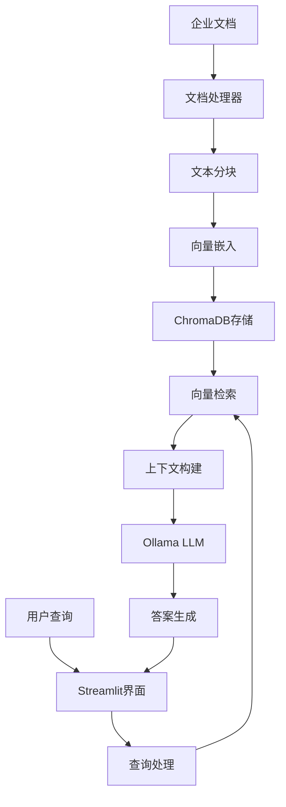

# 系统一：零成本本地化RAG知识问答系统

## 🎯 系统概述

这是一个完全本地化的RAG（Retrieval-Augmented Generation）知识问答系统，旨在提供零云端费用、保护企业数据隐私的解决方案。

## ✨ 核心特性

- 🆓 **零成本运行**：无云服务费用，仅需本地硬件
- 🔒 **数据隐私**：文档和查询完全本地处理，不上传云端
- ⚡ **快速响应**：本地推理，无网络延迟
- 📚 **多格式支持**：PDF、Word、Markdown、TXT等
- 🎨 **友好界面**：基于Streamlit的直观Web界面
- 🔧 **易于部署**：一键安装，开箱即用

## 🏗️ 技术架构



## 🛠️ 技术栈

| 组件 | 技术选型 | 版本 | 作用 |
|------|---------|------|------|
| **LLM** | Ollama + Llama3.1 | Latest | 本地大语言模型推理 |
| **向量数据库** | ChromaDB | 0.4.0+ | 文档向量存储和检索 |
| **嵌入模型** | sentence-transformers | Latest | 文本向量化 |
| **前端框架** | Streamlit | 1.28.0+ | Web用户界面 |
| **文档处理** | PyPDF2, python-docx | Latest | 多格式文档解析 |
| **RAG框架** | LangChain | 0.1.0+ | 检索增强生成流程 |

## 📁 项目结构

```
system-1-local-free/
├── README.md                    # 本文件
├── requirements.txt             # Python依赖
├── src/                         # 核心源码
│   ├── main.py                 # Streamlit主应用
│   ├── document_processor.py   # 文档处理模块
│   ├── vector_store.py        # ChromaDB向量存储
│   ├── llm_manager.py         # Ollama LLM管理
│   ├── rag_pipeline.py        # RAG主流程
│   └── utils/                 # 工具模块
│       ├── config.py          # 配置管理
│       └── helpers.py         # 辅助函数
├── config/                     # 配置文件
│   ├── app_config.yaml        # 应用配置
│   └── model_config.yaml      # 模型配置
├── data/                      # 数据目录
│   ├── documents/             # 上传文档
│   └── vector_db/            # 向量数据库存储
├── tests/                     # 测试代码
├── docs/                      # 文档
└── logs/                      # 日志文件
```

## 🚀 快速开始

### 1. 环境准备

```bash
# 确保Python版本 >= 3.8
python --version

# 创建虚拟环境
python -m venv venv
source venv/bin/activate  # Linux/Mac
# 或者 venv\Scripts\activate  # Windows
```

### 2. 安装依赖

```bash
cd system-1-local-free
pip install -r requirements.txt
```

### 3. 安装Ollama

```bash
# Mac
brew install ollama

# Linux
curl -fsSL https://ollama.com/install.sh | sh

# 启动Ollama服务
ollama serve

# 下载Llama3.1模型
ollama pull llama3.1:8b
```

### 4. 启动系统

```bash
streamlit run src/main.py
```

系统将在浏览器中打开，默认地址：`http://localhost:8501`

## 💡 使用指南

### 文档上传
1. 点击侧边栏的"上传文档"按钮
2. 选择PDF、Word或Markdown文件
3. 系统自动处理并建立向量索引

### 知识问答
1. 在主界面输入问题
2. 系统检索相关文档片段
3. 基于检索结果生成准确答案

### 高级功能
- **批量上传**：一次上传多个文档
- **文档管理**：查看、删除已上传文档
- **检索调试**：查看检索到的相关片段
- **对话历史**：保存问答记录

## 🔧 配置说明

### 应用配置 (`config/app_config.yaml`)
```yaml
app:
  name: "企业RAG知识问答系统"
  version: "1.0.0"
  debug: false

vector_store:
  chunk_size: 500
  chunk_overlap: 50
  collection_name: "enterprise_docs"

retrieval:
  top_k: 5
  similarity_threshold: 0.7
```

### 模型配置 (`config/model_config.yaml`)
```yaml
llm:
  model_name: "llama3.1:8b"
  temperature: 0.1
  max_tokens: 1000

embedding:
  model_name: "all-MiniLM-L6-v2"
  dimension: 384
```

## 📊 性能参数

| 指标 | 规格 |
|------|------|
| **响应时间** | < 3秒（本地推理） |
| **文档容量** | 无限制（受本地存储限制） |
| **支持语言** | 中文、英文 |
| **并发用户** | 1-10人（受硬件限制） |
| **内存需求** | 8GB+ 推荐 |
| **存储需求** | 10GB+（含模型文件） |

## 🔍 系统监控

### 性能监控
- CPU和内存使用率
- 响应时间统计
- 查询成功率

### 日志管理
```
logs/
├── app.log          # 应用日志
├── error.log        # 错误日志
└── performance.log  # 性能日志
```

## 🛡️ 安全特性

- **数据本地化**：所有数据处理在本地进行
- **无网络依赖**：离线也可正常工作
- **访问控制**：可配置用户认证
- **日志审计**：详细操作记录

## 🔄 升级指南

### 模型升级
```bash
# 下载更新的模型
ollama pull llama3.1:70b  # 更大更强的模型

# 修改配置文件中的模型名称
```

### 功能扩展
- 添加更多文档格式支持
- 集成更多开源LLM
- 增强用户界面功能

## 🐛 故障排除

### 常见问题

1. **Ollama服务无法启动**
   ```bash
   # 检查服务状态
   ollama serve
   ```

2. **向量数据库初始化失败**
   ```bash
   # 清空数据库重新初始化
   rm -rf data/vector_db/
   ```

3. **内存不足**
   - 使用更小的模型（如llama3.1:7b）
   - 调整chunk_size参数

## 📈 性能优化

### 硬件建议
- **CPU**: 8核心以上
- **内存**: 16GB+
- **存储**: SSD推荐
- **GPU**: 可选，加速推理

### 软件优化
- 启用文档缓存
- 调优检索参数
- 使用更高效的嵌入模型

## 🤝 贡献指南

1. Fork本项目
2. 创建功能分支
3. 提交代码更改
4. 创建Pull Request

## 📄 开源协议

MIT License

---

**开发团队**：企业RAG研发小组  
**最后更新**：2025年1月21日  
**系统版本**：v1.0.0