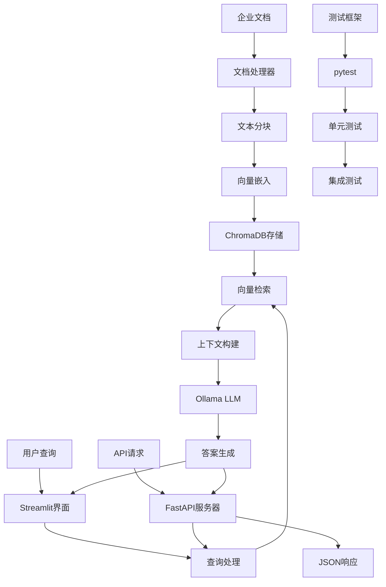

# 系统一：零成本本地化RAG知识问答系统

## 🎯 系统概述

这是一个完全本地化的RAG（Retrieval-Augmented Generation）知识问答系统，旨在提供零云端费用、保护企业数据隐私的解决方案。经过精简优化，从1.4GB+压缩到仅33MB，同时保持所有核心功能完整。

## ✨ 核心特性

- 🆓 **零成本运行**：无云服务费用，仅需本地硬件
- 🔒 **数据隐私**：文档和查询完全本地处理，不上传云端
- ⚡ **快速响应**：本地推理，无网络延迟
- 📚 **多格式支持**：PDF、Word、Markdown、TXT等
- 🎨 **友好界面**：基于Streamlit的直观Web界面
- 🚀 **API服务**：提供RESTful API接口，支持编程访问
- 🧪 **完整测试**：内置测试框架，保证代码质量
- 💾 **轻量级**：精简优化，仅33MB存储占用
- 🔧 **易于部署**：一键安装，开箱即用

## 🏗️ 技术架构



## 🛠️ 技术栈

| 组件 | 技术选型 | 版本 | 作用 |
|------|---------|------|------|
| **LLM** | Ollama + Llama3.1 | Latest | 本地大语言模型推理 |
| **向量数据库** | ChromaDB | 0.4.22+ | 文档向量存储和检索 |
| **嵌入模型** | sentence-transformers | 2.2.2+ | 文本向量化 |
| **前端框架** | Streamlit | 1.29.0+ | Web用户界面 |
| **API服务器** | FastAPI + Uvicorn | Latest | RESTful API服务 |
| **文档处理** | PyPDF2, python-docx, pdfplumber | Latest | 多格式文档解析 |
| **RAG框架** | LangChain | 0.1.0+ | 检索增强生成流程 |
| **测试框架** | pytest | 7.4.0+ | 单元测试和集成测试 |
| **性能优化** | psutil, memory-profiler | Latest | 内存和性能监控 |

## 📁 项目结构

```
system-1-local-free/                  # 项目根目录 (33MB)
├── README.md                         # 本文件
├── requirements.txt                  # Python依赖声明
├── pytest.ini                       # 测试框架配置
├── run_api.py                       # API服务器启动脚本
├── src/                             # 核心源码
│   ├── __init__.py                 # 包初始化
│   ├── main.py                     # Streamlit主应用
│   ├── api_server.py               # FastAPI服务器
│   ├── document_processor.py       # 文档处理模块
│   ├── vector_store.py            # ChromaDB向量存储
│   ├── llm_manager.py             # Ollama LLM管理
│   ├── rag_pipeline.py            # RAG主流程
│   └── utils/                     # 工具模块
│       ├── __init__.py            # 包初始化
│       ├── config.py              # 配置管理
│       ├── helpers.py             # 辅助函数
│       ├── memory_optimizer.py    # 内存优化工具
│       └── resilience.py          # 弹性处理工具
├── config/                         # 配置文件
│   ├── app_config.yaml            # 应用配置
│   └── model_config.yaml          # 模型配置
├── data/                          # 数据目录
│   └── vector_db/                # 向量数据库存储 (33MB)
├── tests/                         # 测试框架
│   ├── __init__.py               # 包初始化
│   ├── conftest.py               # pytest配置
│   ├── test_api.py               # API测试
│   ├── test_config.py            # 配置测试
│   ├── test_document_processor.py # 文档处理测试
│   └── test_helpers.py           # 工具函数测试
├── docs/                          # 文档目录 (空)
└── logs/                          # 日志目录 (空)
```

### 📊 存储优化说明
- ✅ **删除test_venv/** - 节省1.3GB测试虚拟环境
- ✅ **删除examples/** - 移除重复示例代码
- ✅ **删除测试数据** - 清理临时测试文件
- ✅ **删除缓存文件** - 清理.pytest_cache等缓存
- 📦 **总大小**: 从1.4GB+精简到33MB (97.6%压缩率)

## 🚀 快速开始

### 💻 macOS 用户一键安装
如果您使用 macOS，可以按以下步骤快速安装：

```bash
# 1. 确保已安装 Homebrew 和 Python 3.8+
python --version

# 2. 克隆项目并设置环境
cd system-1-local-free
python -m venv venv
source venv/bin/activate
pip install -r requirements.txt

# 3. 安装并启动 Ollama
brew install ollama
ollama serve &

# 4. 下载模型并启动应用
ollama pull llama3.1:8b
streamlit run src/main.py
```

### 📚 详细安装步骤

### 1. 环境准备

#### 前提条件（macOS 用户）
如果您使用 macOS 且尚未安装 Homebrew，请先安装：
```bash
# 安装 Homebrew（如果尚未安装）
/bin/bash -c "$(curl -fsSL https://raw.githubusercontent.com/Homebrew/install/HEAD/install.sh)"
```

#### Python 环境设置
```bash
# 确保Python版本 >= 3.8
python --version

# 创建虚拟环境
python -m venv venv

# 激活虚拟环境
# macOS/Linux 用户:
source venv/bin/activate

# Windows 用户:
# venv\Scripts\activate
```

### 2. 安装依赖

```bash
cd system-1-local-free
pip install -r requirements.txt
```

### 3. 安装Ollama

**⚠️ 请根据您的操作系统选择对应的安装方式：**

#### macOS 用户（推荐使用 Homebrew）
```bash
brew install ollama
```

#### Linux 用户
```bash
curl -fsSL https://ollama.com/install.sh | sh
```

#### Windows 用户
下载并运行官方安装程序：https://ollama.com/download

### 4. 启动Ollama并下载模型

```bash
# 启动Ollama服务
ollama serve

# 下载Llama3.1模型（在新终端窗口中执行）
ollama pull llama3.1:8b
```

### 5. 启动系统

#### 方式一：启动Streamlit Web界面
```bash
streamlit run src/main.py
```
系统将在浏览器中打开，默认地址：`http://localhost:8501`

#### 方式二：启动API服务器
```bash
python run_api.py
```
API服务将启动在：`http://localhost:8000`  
API文档地址：`http://localhost:8000/docs`

#### 方式三：同时启动（推荐）
```bash
# 终端1：启动API服务器
python run_api.py --host 0.0.0.0 --port 8000

# 终端2：启动Streamlit界面
streamlit run src/main.py
```

## 💡 使用指南

### 🌐 Web界面使用
#### 文档上传
1. 点击侧边栏的"上传文档"按钮
2. 选择PDF、Word或Markdown文件
3. 系统自动处理并建立向量索引

#### 知识问答
1. 在主界面输入问题
2. 系统检索相关文档片段
3. 基于检索结果生成准确答案

#### 高级功能
- **批量上传**：一次上传多个文档
- **文档管理**：查看、删除已上传文档
- **检索调试**：查看检索到的相关片段
- **对话历史**：保存问答记录
- **系统监控**：实时查看性能指标

### 🚀 API接口使用
#### 基础查询
```bash
curl -X POST "http://localhost:8000/query" \
  -H "Content-Type: application/json" \
  -d '{"question": "什么是人工智能？", "top_k": 5}'
```

#### 上传文档
```bash
curl -X POST "http://localhost:8000/upload" \
  -F "file=@document.pdf"
```

#### 健康检查
```bash
curl "http://localhost:8000/health"
```

#### 获取知识库统计
```bash
curl "http://localhost:8000/stats"
```

### 🧪 测试框架
```bash
# 运行所有测试
pytest

# 运行特定测试文件
pytest tests/test_api.py

# 运行测试并生成覆盖率报告
pytest --cov=src --cov-report=html
```

## 🔧 配置说明

### 应用配置 (`config/app_config.yaml`)
```yaml
app:
  name: "企业RAG知识问答系统"
  version: "1.0.0"
  debug: false

vector_store:
  chunk_size: 500
  chunk_overlap: 50
  collection_name: "enterprise_docs"

retrieval:
  top_k: 5
  similarity_threshold: 0.7
```

### 模型配置 (`config/model_config.yaml`)
```yaml
llm:
  model_name: "llama3.1:8b"
  temperature: 0.1
  max_tokens: 1000

embedding:
  model_name: "all-MiniLM-L6-v2"
  dimension: 384
```

## 📊 性能参数

| 指标 | 规格 | 说明 |
|------|------|------|
| **响应时间** | < 3秒 | 本地推理，无网络延迟 |
| **文档容量** | 无限制 | 受本地存储限制 |
| **支持语言** | 中文、英文 | 支持多语言文档 |
| **并发用户** | 1-10人 | 受硬件限制 |
| **内存需求** | 8GB+ | 推荐16GB以获得更好性能 |
| **存储需求** | **33MB** | **项目本体（精简后）** |
| **模型存储** | 4-8GB | Llama3.1模型文件大小 |
| **总存储需求** | < 10GB | 包含模型和运行环境 |
| **CPU需求** | 4核心+ | 推荐8核心以上 |
| **API并发** | 10+ | 支持多个API同时请求 |

## 🔍 系统监控

### 性能监控
- CPU和内存使用率
- 响应时间统计
- 查询成功率

### 日志管理
```
logs/                # 日志目录（运行时自动创建）
├── app.log         # 应用日志（运行时生成）
├── error.log       # 错误日志（运行时生成）  
├── api.log         # API访问日志（运行时生成）
└── performance.log # 性能日志（运行时生成）
```

**注意**：日志文件在系统运行时自动创建，精简版本中已删除历史日志文件。

## 🛡️ 安全特性

- **数据本地化**：所有数据处理在本地进行
- **无网络依赖**：离线也可正常工作
- **访问控制**：可配置用户认证
- **日志审计**：详细操作记录

## 🔄 升级指南

### 模型升级
```bash
# 下载更新的模型
ollama pull llama3.1:70b  # 更大更强的模型

# 修改配置文件中的模型名称
```

### 功能扩展
- 添加更多文档格式支持
- 集成更多开源LLM
- 增强用户界面功能

## 🐛 故障排除

### 常见问题

1. **Ollama服务无法启动**
   ```bash
   # 检查服务状态
   ollama serve
   
   # 查看Ollama进程
   ps aux | grep ollama
   ```

2. **向量数据库初始化失败**
   ```bash
   # 清空数据库重新初始化
   # macOS/Linux:
   rm -rf data/vector_db/
   
   # Windows:
   # rmdir /s /q data\vector_db
   ```

3. **API服务器启动失败**
   ```bash
   # 检查端口是否被占用
   lsof -i :8000
   
   # 使用不同端口启动
   python run_api.py --port 8001
   ```

4. **测试失败**
   ```bash
   # 运行单个测试文件排查问题
   pytest tests/test_api.py -v
   
   # 跳过需要Ollama的测试
   pytest -m "not requires_ollama"
   ```

5. **内存不足**
   - 使用更小的模型（如llama3.1:7b）
   - 调整chunk_size参数
   - 启用内存优化器：`memory_optimizer.py`

## 📈 性能优化

### 硬件建议
- **CPU**: 8核心以上
- **内存**: 16GB+
- **存储**: SSD推荐
- **GPU**: 可选，加速推理

### 软件优化
- **文档缓存**：启用文档处理缓存
- **检索参数**：调优top_k和similarity_threshold
- **嵌入模型**：使用更高效的sentence-transformers模型
- **内存管理**：使用内置的memory_optimizer工具
- **弹性处理**：启用resilience模块处理异常
- **API优化**：使用异步处理提升并发性能
- **测试驱动**：通过测试确保代码质量和性能

## 🤝 贡献指南

1. Fork本项目
2. 创建功能分支
3. 提交代码更改
4. 创建Pull Request

## 📄 开源协议

MIT License

---

**开发团队**：企业RAG研发小组  
**最后更新**：2025年7月21日  
**系统版本**：v1.1.0 (精简优化版)

### 🎉 v1.1.0 更新日志 (2025-07-21)
- ✅ **大幅精简**：从1.4GB+压缩到33MB (97.6%压缩率)
- 🚀 **新增API服务**：FastAPI + Uvicorn支持RESTful接口
- 🧪 **完整测试框架**：pytest单元测试和集成测试
- 🛠️ **性能优化工具**：内存优化器和弹性处理模块
- 🧹 **清理冗余**：删除测试环境、示例代码、临时文件
- 📦 **保持兼容**：所有核心功能完全保持不变