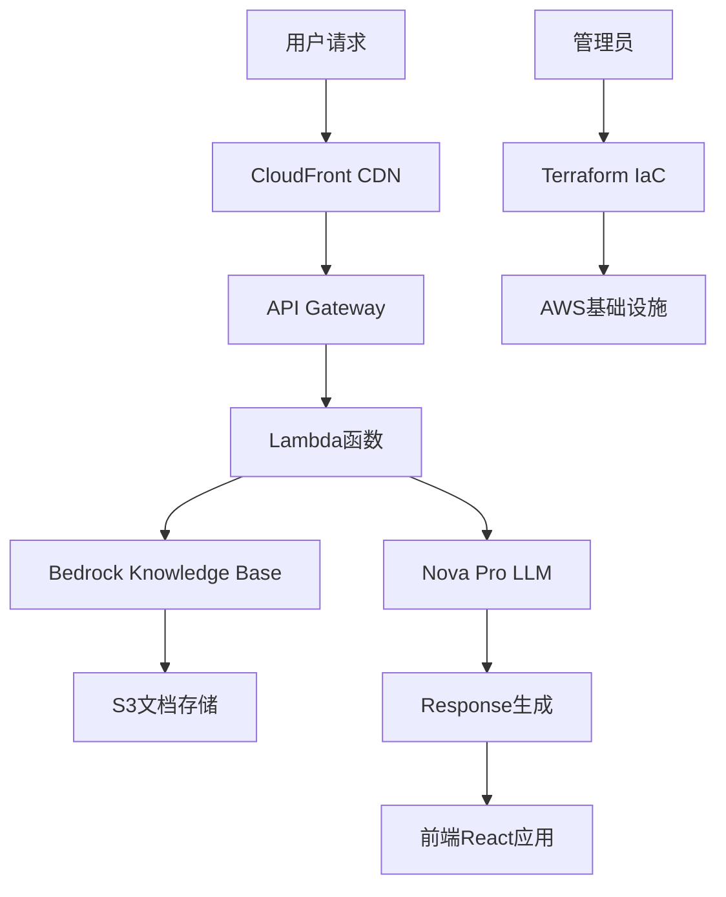

# 系统二：基于AWS Nova的企业级RAG知识问答系统

## 🎯 系统概述

这是一个基于AWS Bedrock和Nova模型的企业级RAG（Retrieval-Augmented Generation）知识问答系统，提供云原生、高可用、弹性扩展的解决方案。

## ✨ 核心特性

- ☁️ **云原生架构**：完全基于AWS云服务构建
- 🚀 **弹性扩展**：自动扩缩容，支持高并发
- 🔒 **企业级安全**：AWS安全体系，数据加密传输和存储
- 🌐 **全球部署**：多区域部署，低延迟访问
- 📊 **监控告警**：完整的监控和日志系统
- 🎨 **现代界面**：基于React的响应式Web界面

## 🏗️ 技术架构



## 🛠️ 技术栈

| 组件 | AWS服务 | 用途 |
|------|---------|------|
| **LLM** | Amazon Bedrock Nova Pro | 大语言模型推理 |
| **知识库** | Amazon Bedrock Knowledge Base | 向量存储和检索 |
| **文档存储** | Amazon S3 | 源文档存储 |
| **计算** | AWS Lambda | 无服务器计算 |
| **API** | API Gateway | RESTful API |
| **前端** | React + CloudFront | 用户界面 |
| **基础设施** | Terraform | 基础设施即代码 |
| **监控** | CloudWatch + X-Ray | 监控和调试 |

## 📁 项目结构

```
system-2-aws-bedrock/
├── README.md                    # 本文件
├── requirements.txt             # Python依赖
├── src/                         # 源代码
│   ├── lambda/                  # Lambda函数
│   │   ├── api/                # API处理函数
│   │   ├── document_processor/ # 文档处理函数
│   │   └── utils/              # 工具函数
│   ├── frontend/               # React前端
│   │   ├── src/
│   │   ├── public/
│   │   └── package.json
│   └── scripts/                # 部署脚本
├── terraform/                  # Terraform配置
│   ├── main.tf                # 主配置
│   ├── variables.tf           # 变量定义
│   ├── outputs.tf             # 输出定义
│   └── modules/               # 模块
├── config/                     # 配置文件
│   ├── environments/          # 环境配置
│   └── policies/              # IAM策略
├── tests/                      # 测试代码
├── docs/                       # 文档
└── scripts/                    # 部署和维护脚本
```

## 🚀 快速开始

### 前置条件

- AWS账号和适当权限
- AWS CLI配置
- Terraform >= 1.0
- Node.js >= 16
- Python 3.9+

### 1. 环境准备

```bash
# 克隆仓库
git clone <repository-url>
cd system-2-aws-bedrock

# 安装Python依赖
pip install -r requirements.txt

# 安装前端依赖
cd src/frontend
npm install
cd ../..
```

### 2. AWS配置

```bash
# 配置AWS凭证
aws configure

# 启用Bedrock服务访问
aws bedrock list-foundation-models --region us-east-1
```

### 3. 部署基础设施

```bash
cd terraform

# 初始化Terraform
terraform init

# 规划部署
terraform plan

# 执行部署
terraform apply
```

### 4. 部署应用

```bash
# 部署Lambda函数
./scripts/deploy-lambda.sh

# 构建并部署前端
./scripts/deploy-frontend.sh
```

## 📊 成本估算

| 服务 | 预估月费用 | 说明 |
|------|-----------|------|
| **Bedrock Nova Pro** | $30-80 | 基于使用量 |
| **Bedrock Knowledge Base** | $10-30 | 向量存储和检索 |
| **Lambda** | $5-20 | 计算时间 |
| **S3** | $2-10 | 文档存储 |
| **API Gateway** | $3-15 | API调用 |
| **CloudFront** | $1-5 | CDN分发 |
| **其他服务** | $5-15 | 监控、日志等 |
| **总计** | **$56-175** | **根据使用量变化** |

## 🔧 配置说明

### 环境变量

```bash
# 必需环境变量
export AWS_REGION=us-east-1
export BEDROCK_MODEL_ID=amazon.nova-pro-v1:0
export S3_BUCKET_NAME=your-document-bucket
export KNOWLEDGE_BASE_ID=your-kb-id
```

### Terraform变量

```hcl
# terraform.tfvars
aws_region = "us-east-1"
environment = "production"
project_name = "enterprise-rag"

# Bedrock配置
bedrock_model_id = "amazon.nova-pro-v1:0"
knowledge_base_embedding_model = "amazon.titan-embed-text-v1"

# 网络配置
vpc_cidr = "10.0.0.0/16"
availability_zones = ["us-east-1a", "us-east-1b"]
```

## 📈 性能参数

| 指标 | 规格 |
|------|------|
| **响应时间** | < 2秒（包含网络延迟） |
| **文档容量** | 无限制（S3存储） |
| **并发用户** | 1000+ （自动扩展） |
| **可用性** | 99.9% SLA |
| **支持语言** | 多语言支持 |
| **全球部署** | 多区域支持 |

## 🔍 监控和运维

### CloudWatch指标

- API响应时间
- Lambda执行时间
- 错误率和成功率
- Bedrock调用次数
- S3存储使用量

### 日志管理

```bash
# 查看API日志
aws logs tail /aws/lambda/rag-api-handler --follow

# 查看文档处理日志
aws logs tail /aws/lambda/document-processor --follow
```

### 告警配置

- 高错误率告警
- 响应时间超时告警
- 成本超限告警
- 资源使用率告警

## 🛡️ 安全特性

### 访问控制
- IAM角色和策略
- API Gateway认证
- VPC网络隔离
- 资源级权限控制

### 数据保护
- 传输加密（TLS/SSL）
- 静态数据加密（KMS）
- S3存储桶安全配置
- 访问日志审计

### 合规性
- SOC 2兼容
- GDPR数据保护
- HIPAA合规选项
- ISO 27001标准

## 📚 API文档

### 核心端点

```bash
# 文档上传
POST /api/documents
Content-Type: multipart/form-data

# 知识问答
POST /api/query
{
    "question": "用户问题",
    "top_k": 5,
    "include_sources": true
}

# 对话聊天
POST /api/chat
{
    "messages": [
        {"role": "user", "content": "问题"}
    ]
}

# 系统状态
GET /api/health
```

### 响应格式

```json
{
    "success": true,
    "data": {
        "answer": "生成的回答",
        "sources": [
            {
                "document": "文档名称",
                "content": "相关内容",
                "confidence": 0.95
            }
        ]
    },
    "metadata": {
        "response_time": 1.2,
        "model_used": "nova-pro-v1",
        "tokens_used": 150
    }
}
```

## 🔄 CI/CD流程

### 自动化部署

```yaml
# GitHub Actions示例
name: Deploy RAG System
on:
  push:
    branches: [main]
  
jobs:
  deploy:
    runs-on: ubuntu-latest
    steps:
      - uses: actions/checkout@v3
      - name: Deploy Infrastructure
        run: |
          cd terraform
          terraform apply -auto-approve
      - name: Deploy Lambda
        run: ./scripts/deploy-lambda.sh
      - name: Deploy Frontend
        run: ./scripts/deploy-frontend.sh
```

## 🐛 故障排除

### 常见问题

1. **Bedrock模型访问被拒绝**
   ```bash
   # 启用模型访问权限
   aws bedrock put-model-invocation-logging-configuration
   ```

2. **知识库检索无结果**
   ```bash
   # 检查文档同步状态
   aws bedrock-agent get-knowledge-base --knowledge-base-id <KB_ID>
   ```

3. **Lambda函数超时**
   - 增加函数超时时间
   - 检查网络配置
   - 优化代码性能

### 诊断工具

```bash
# AWS CLI诊断
./scripts/diagnose-system.sh

# 性能测试
./scripts/load-test.sh

# 健康检查
curl https://your-api-domain.com/api/health
```

## 🤝 贡献指南

1. Fork项目
2. 创建功能分支
3. 编写测试
4. 提交PR
5. 代码审查

## 📄 许可证

MIT License

## 📞 支持

- 📧 Email: support@enterprise-rag.com
- 💬 Issues: GitHub Issues
- 📖 文档: [完整文档](./docs/)

---

**开发团队**: 企业RAG研发小组  
**最后更新**: 2025年1月21日  
**系统版本**: v1.0.0