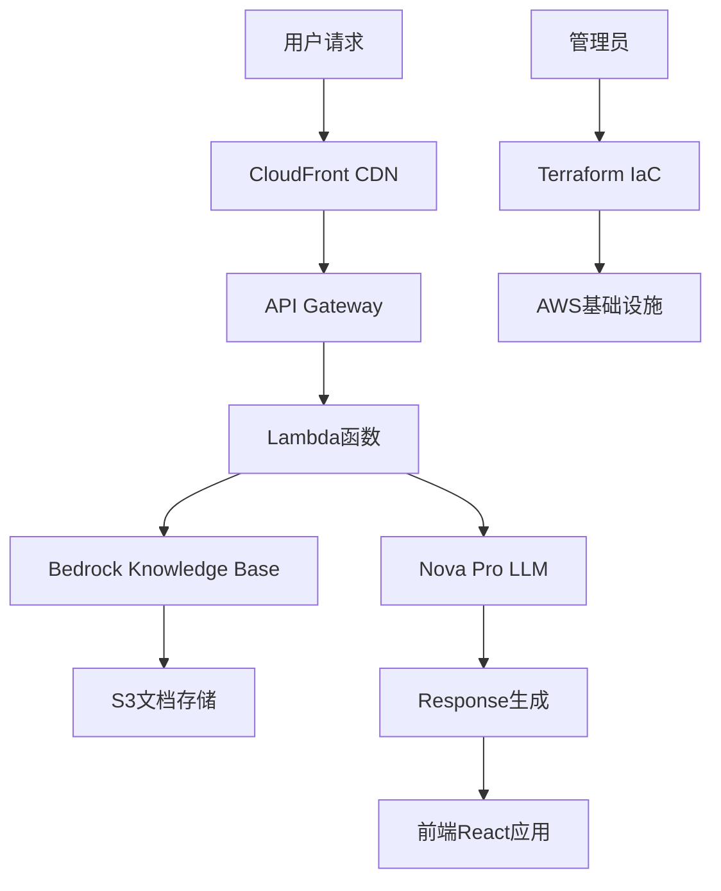

# 系统二：基于AWS Nova的企业级RAG知识问答系统

## 🎯 系统概述

这是一个基于AWS Bedrock和Nova模型的企业级RAG（Retrieval-Augmented Generation）知识问答系统，提供云原生、高可用、弹性扩展的解决方案。

### 🆕 最新特性（v1.1）
- 🚀 **一键部署**: 通过集成Terraform实现真正的一键部署体验
- 📦 **自动构建**: Lambda和React应用自动构建和打包
- 🔧 **智能配置**: 自动环境变量注入和配置管理
- 🌍 **多环境**: 支持dev/staging/prod环境一键切换
- 🛠️ **完整验证**: 部署前自动检查所有依赖和权限

## ✨ 核心特性

### 🏗️ 架构特性
- ☁️ **云原生架构**：完全基于AWS云服务构建
- 🚀 **弹性扩展**：Serverless架构，自动扩缩容，支持高并发
- 🔄 **高可用性**：多AZ部署，99.9%+ SLA保证

### 🔒 企业级安全
- 🛡️ **多层安全防护**：WAF + VPC + 安全组 + IAM
- 🔐 **身份认证**：Cognito + 多因素认证 + JWT
- 🌐 **网络隔离**：VPC私有网络，VPC端点
- 📡 **DDoS防护**：AWS Shield + 频率限制
- 🔍 **安全监控**：实时威胁检测和告警

### 🧠 AI能力
- 🤖 **先进LLM**：Amazon Nova Pro模型
- 📚 **知识库**：OpenSearch Serverless向量数据库
- 🔍 **智能检索**：语义搜索和上下文理解
- 📄 **文档处理**：多格式文档解析和分块

### 📊 运维监控
- 🔍 **全链路追踪**：X-Ray分布式追踪
- 📈 **实时监控**：CloudWatch Dashboard和自定义指标
- 🚨 **智能告警**：多维度告警和SNS通知
- 💰 **成本控制**：预算告警和使用量监控

### 🎨 用户体验
- 📱 **现代界面**：基于React的响应式Web界面
- 🚀 **低延迟**：< 2秒响应时间
- 🌍 **多语言**：支持多语言查询和回答
- 📊 **来源追踪**：答案可溯源到具体文档

## 🏗️ 技术架构



## 🛠️ 技术栈

| 组件 | AWS服务 | 用途 |
|------|---------|------|
| **LLM** | Amazon Bedrock Nova Pro | 大语言模型推理 |
| **知识库** | Amazon Bedrock Knowledge Base | 向量存储和检索 |
| **文档存储** | Amazon S3 | 源文档存储 |
| **计算** | AWS Lambda | 无服务器计算 |
| **API** | API Gateway | RESTful API |
| **前端** | React + CloudFront | 用户界面 |
| **基础设施** | Terraform | 基础设施即代码 |
| **监控** | CloudWatch + X-Ray | 监控和调试 |

## 📁 项目结构

```
system-2-aws-bedrock/
├── README.md                    # 本文件
├── requirements.txt             # Python依赖
├── src/                         # 源代码
│   ├── lambda/                  # Lambda函数
│   │   ├── api/                # API处理函数
│   │   ├── document_processor/ # 文档处理函数
│   │   └── utils/              # 工具函数
│   ├── frontend/               # React前端应用
│   │   ├── src/                # React源代码
│   │   ├── public/             # 静态资源
│   │   └── package.json        # 前端依赖
│   └── scripts/                # 自动化脚本
│       ├── deploy.sh           # 🚀 一键部署脚本
│       ├── build-lambda.sh     # Lambda构建脚本
│       └── build-frontend.sh   # 前端构建脚本
├── terraform/                  # Terraform基础设施即代码
│   ├── main.tf                # 主配置
│   ├── lambda.tf              # Lambda函数配置
│   ├── frontend.tf            # 前端部署配置
│   ├── variables.tf           # 变量定义
│   ├── outputs.tf             # 输出定义
│   └── environments/          # 环境配置目录
├── tests/                      # 测试代码
├── docs/                       # 文档
└── .build/                     # 构建临时目录
```

## 🚀 快速开始

本系统提供**真正的一键部署**，通过集成的Terraform配置和自动化脚本，实现基础设施和应用的统一部署。

### 前置条件

- AWS账号和适当权限（支持Bedrock服务）
- AWS CLI已配置
- Terraform >= 1.0
- Node.js >= 16 （前端构建）
- Python 3.9+ （Lambda函数）
- jq （推荐，用于JSON处理）

### ⚡ 一键部署（推荐）

```bash
# 1. 克隆项目
git clone <repository-url>
cd system-2-aws-bedrock

# 2. 配置AWS凭证
aws configure

# 3. 一键部署整个系统 🚀
./src/scripts/deploy.sh
```

**就这么简单！** 部署脚本会自动：
- ✅ 检查必要工具和依赖
- ✅ 验证AWS凭证和Bedrock访问权限
- ✅ 初始化Terraform配置
- ✅ 构建Lambda函数和React前端
- ✅ 部署完整的基础设施
- ✅ 配置所有AWS服务
- ✅ 提供访问链接和系统信息

### 🎯 不同环境部署

```bash
# 部署到开发环境（默认）
./src/scripts/deploy.sh

# 部署到生产环境
./src/scripts/deploy.sh -e prod -r us-west-2

# 仅部署前端
./src/scripts/deploy.sh --frontend-only

# 仅部署后端
./src/scripts/deploy.sh --backend-only

# 自动确认所有提示（CI/CD环境）
./src/scripts/deploy.sh -y

# 查看所有选项
./src/scripts/deploy.sh --help
```

### 🗑️ 快速清理

```bash
# 销毁所有资源
./src/scripts/deploy.sh --destroy

# 自动确认销毁
./src/scripts/deploy.sh --destroy -y
```

### 🔧 高级配置（可选）

如果需要自定义配置，可以手动执行：

```bash
# 1. 创建环境配置文件
mkdir -p terraform/environments
cat > terraform/environments/prod.tfvars << EOF
aws_region = "us-west-2"
environment = "prod"
project_name = "my-rag-system"
enable_waf = true
enable_detailed_monitoring = true
lambda_memory_size = 1024
EOF

# 2. 使用自定义配置部署
./src/scripts/deploy.sh -e prod
```

## 🚀 部署特性

### ✨ 全自动化部署流程

我们的部署系统实现了**真正的基础设施即代码（IaC）**，包含以下特性：

#### 📦 一体化构建
- **Lambda函数**: 自动安装依赖、打包ZIP、版本管理
- **React前端**: TypeScript编译、优化构建、CDN部署  
- **环境配置**: 自动注入AWS配置到前端应用

#### 🔧 智能化部署
- **依赖检查**: 自动验证所有必要工具
- **权限验证**: 检查AWS凭证和Bedrock访问权限
- **增量部署**: 只有变更的组件才会重新部署
- **失败回滚**: 部署失败时自动清理

#### 🌍 多环境支持
- **开发环境** (`dev`): 最小化配置，节省成本
- **预发环境** (`staging`): 生产级配置，用于测试
- **生产环境** (`prod`): 全功能配置，包含所有安全特性

#### 📊 部署输出
部署完成后，您将获得：
```bash
🎉 部署完成！

📋 系统信息:
  API Gateway URL: https://abcd1234.execute-api.us-east-1.amazonaws.com/dev
  前端URL: https://d123456789.cloudfront.net
  用户池ID: us-east-1_AbCdEfGhI

🔗 有用链接:
  AWS控制台: https://us-east-1.console.aws.amazon.com/
  CloudWatch Dashboard: https://us-east-1.console.aws.amazon.com/cloudwatch/
  Bedrock Console: https://us-east-1.console.aws.amazon.com/bedrock/

📖 下一步:
  1. 访问前端URL开始使用系统
  2. 上传文档到知识库
  3. 查看CloudWatch监控和日志
```

## 📊 成本估算（已更新）

| 服务类别 | 服务 | 预估月费用 | 说明 |
|---------|------|-----------|------|
| **AI服务** | Bedrock Nova Pro | $40-120 | 基于使用量和token数 |
| | Bedrock Knowledge Base | $25-80 | 向量存储和检索 |
| **计算** | Lambda (VPC) | $15-40 | 函数执行和VPC成本 |
| **存储** | S3 + 版本控制 | $5-20 | 文档存储和备份 |
| | OpenSearch Serverless | $20-60 | 向量数据库 |
| **网络** | VPC + NAT网关 | $20-45 | 网络基础设施 |
| | API Gateway | $5-25 | API调用和数据传输 |
| **安全** | WAF + Shield | $10-30 | Web应用防火墙 |
| | Cognito | $3-15 | 用户认证服务 |
| **监控** | CloudWatch + X-Ray | $8-25 | 日志、指标和追踪 |
| | SNS告警 | $1-5 | 通知服务 |
| **其他** | 备份和杂项 | $5-15 | 其他AWS服务 |
| **总计** | | **$157-480** | **企业级配置成本** |

### 💰 成本优化建议
- **开发环境**: 禁用WAF、Shield等生产级服务，预估成本: $80-200/月
- **生产环境**: 启用所有安全和监控功能，预估成本: $200-480/月
- **成本控制**: 配置CloudWatch Cost Anomaly Detection和预算告警

## 🔧 配置说明

### 环境变量

```bash
# 必需环境变量
export AWS_REGION=us-east-1
export BEDROCK_MODEL_ID=amazon.nova-pro-v1:0
export S3_BUCKET_NAME=your-document-bucket
export KNOWLEDGE_BASE_ID=your-kb-id
```

### Terraform变量

```hcl
# terraform.tfvars
aws_region = "us-east-1"
environment = "production"
project_name = "enterprise-rag"

# Bedrock配置
bedrock_model_id = "amazon.nova-pro-v1:0"
knowledge_base_embedding_model = "amazon.titan-embed-text-v1"

# 网络配置
vpc_cidr = "10.0.0.0/16"
availability_zones = ["us-east-1a", "us-east-1b"]
```

## 📈 性能参数

| 指标 | 规格 |
|------|------|
| **响应时间** | < 2秒（包含网络延迟） |
| **文档容量** | 无限制（S3存储） |
| **并发用户** | 1000+ （自动扩展） |
| **可用性** | 99.9% SLA |
| **支持语言** | 多语言支持 |
| **全球部署** | 多区域支持 |

## 🔍 监控和运维

### CloudWatch指标

- API响应时间
- Lambda执行时间
- 错误率和成功率
- Bedrock调用次数
- S3存储使用量

### 日志管理

```bash
# 查看API日志
aws logs tail /aws/lambda/rag-api-handler --follow

# 查看文档处理日志
aws logs tail /aws/lambda/document-processor --follow
```

### 告警配置

- 高错误率告警
- 响应时间超时告警
- 成本超限告警
- 资源使用率告警

## 🛡️ 安全特性

### 访问控制
- IAM角色和策略
- API Gateway认证
- VPC网络隔离
- 资源级权限控制

### 数据保护
- 传输加密（TLS/SSL）
- 静态数据加密（KMS）
- S3存储桶安全配置
- 访问日志审计

### 合规性
- SOC 2兼容
- GDPR数据保护
- HIPAA合规选项
- ISO 27001标准

## 📚 API文档

### 核心端点

```bash
# 文档上传
POST /api/documents
Content-Type: multipart/form-data

# 知识问答
POST /api/query
{
    "question": "用户问题",
    "top_k": 5,
    "include_sources": true
}

# 对话聊天
POST /api/chat
{
    "messages": [
        {"role": "user", "content": "问题"}
    ]
}

# 系统状态
GET /api/health
```

### 响应格式

```json
{
    "success": true,
    "data": {
        "answer": "生成的回答",
        "sources": [
            {
                "document": "文档名称",
                "content": "相关内容",
                "confidence": 0.95
            }
        ]
    },
    "metadata": {
        "response_time": 1.2,
        "model_used": "nova-pro-v1",
        "tokens_used": 150
    }
}
```

## 🔄 CI/CD流程

### 自动化部署

使用一键部署脚本，CI/CD变得极其简单：

```yaml
# GitHub Actions示例
name: Deploy RAG System
on:
  push:
    branches: [main]
  pull_request:
    branches: [main]

env:
  AWS_REGION: us-east-1
  ENVIRONMENT: ${{ github.ref == 'refs/heads/main' && 'prod' || 'dev' }}

jobs:
  deploy:
    runs-on: ubuntu-latest
    steps:
      - name: Checkout code
        uses: actions/checkout@v4
        
      - name: Configure AWS credentials
        uses: aws-actions/configure-aws-credentials@v4
        with:
          aws-access-key-id: ${{ secrets.AWS_ACCESS_KEY_ID }}
          aws-secret-access-key: ${{ secrets.AWS_SECRET_ACCESS_KEY }}
          aws-region: ${{ env.AWS_REGION }}
          
      - name: Setup Terraform
        uses: hashicorp/setup-terraform@v3
        with:
          terraform_version: "~1.0"
          
      - name: Setup Node.js
        uses: actions/setup-node@v4
        with:
          node-version: '18'
          
      - name: Setup Python
        uses: actions/setup-python@v4
        with:
          python-version: '3.9'
          
      - name: Deploy RAG System 🚀
        run: |
          # 一键部署整个系统
          ./src/scripts/deploy.sh \
            --environment ${{ env.ENVIRONMENT }} \
            --region ${{ env.AWS_REGION }} \
            --yes
            
      - name: Run Health Check
        run: |
          # 获取API端点并进行健康检查
          API_URL=$(cd terraform && terraform output -raw api_gateway_url)
          curl -f "${API_URL}/health" || exit 1
```

### 🔧 多环境CI/CD

```yaml
# 多环境部署示例
name: Multi-Environment Deploy
on:
  workflow_dispatch:
    inputs:
      environment:
        description: 'Target environment'
        required: true
        default: 'dev'
        type: choice
        options:
        - dev
        - staging
        - prod

jobs:
  deploy:
    runs-on: ubuntu-latest
    environment: ${{ github.event.inputs.environment }}
    steps:
      - uses: actions/checkout@v4
      - name: Deploy to ${{ github.event.inputs.environment }}
        run: |
          ./src/scripts/deploy.sh \
            -e ${{ github.event.inputs.environment }} \
            -y
```

## 🐛 故障排除

### 部署相关问题

1. **部署脚本权限错误**
   ```bash
   # 确保脚本有执行权限
   chmod +x ./src/scripts/deploy.sh
   
   # 检查AWS凭证
   aws sts get-caller-identity
   ```

2. **Bedrock模型访问被拒绝**
   ```bash
   # 检查模型访问权限
   aws bedrock list-foundation-models --region us-east-1
   
   # 确保在AWS控制台中启用了Nova模型访问
   # https://console.aws.amazon.com/bedrock/home#/model-access
   ```

3. **Terraform状态锁定**
   ```bash
   # 如果Terraform状态被锁定，强制解锁
   cd terraform
   terraform force-unlock <LOCK_ID>
   ```

4. **前端构建失败**
   ```bash
   # 检查Node.js版本
   node --version  # 需要 >= 16
   
   # 手动构建前端
   ./src/scripts/build-frontend.sh
   ```

5. **Lambda函数打包失败**
   ```bash
   # 检查Python版本
   python3 --version  # 需要 >= 3.9
   
   # 手动构建Lambda
   ./src/scripts/build-lambda.sh
   ```

### 常见系统问题

1. **知识库检索无结果**
   ```bash
   # 检查文档同步状态
   aws bedrock-agent get-knowledge-base --knowledge-base-id <KB_ID>
   
   # 查看数据源同步状态
   aws bedrock-agent list-data-source-sync-jobs --knowledge-base-id <KB_ID> --data-source-id <DS_ID>
   ```

2. **Lambda函数超时**
   - 增加函数超时时间（在terraform/variables.tf中）
   - 检查VPC网络配置
   - 优化代码性能

3. **API Gateway 403错误**
   - 检查Cognito用户池配置
   - 验证API Gateway授权设置
   - 确认CORS配置

### 🔧 诊断工具

```bash
# 使用部署脚本进行系统健康检查
./src/scripts/deploy.sh --help

# 检查AWS配置
aws configure list

# 检查Terraform状态
cd terraform && terraform show

# 查看CloudWatch日志
aws logs describe-log-groups --query 'logGroups[?contains(logGroupName, `rag`)]'

# 快速健康检查
curl -X GET "$(cd terraform && terraform output -raw api_gateway_url)/health"
```

### 📞 获取帮助

如果遇到问题，请按以下顺序尝试：

1. **查看部署日志**: 运行 `./src/scripts/deploy.sh` 会显示详细的部署过程
2. **检查AWS控制台**: 查看CloudWatch日志和AWS服务状态
3. **验证配置**: 确认terraform/environments/目录下的配置文件
4. **重新部署**: 尝试 `./src/scripts/deploy.sh --destroy` 然后重新部署

## 🤝 贡献指南

1. Fork项目
2. 创建功能分支
3. 编写测试
4. 提交PR
5. 代码审查

## 📄 许可证

MIT License

## 📞 支持

- 📧 Email: support@enterprise-rag.com
- 💬 Issues: GitHub Issues
- 📖 文档: [完整文档](./docs/)

---

**开发团队**: 企业RAG研发小组  
**最后更新**: 2025年1月22日  
**系统版本**: v1.1.0 - 一键部署版本